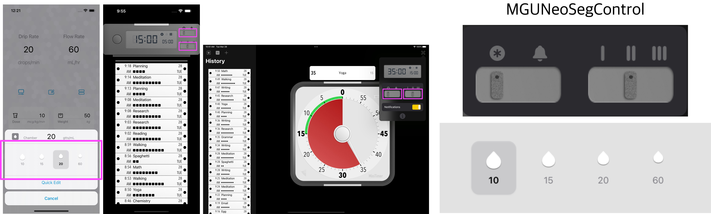
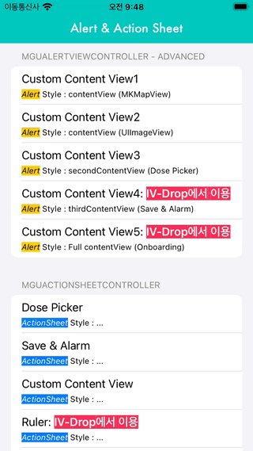
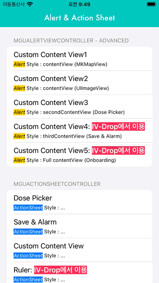
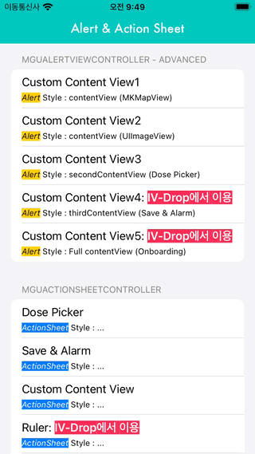
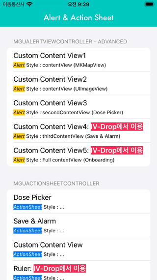
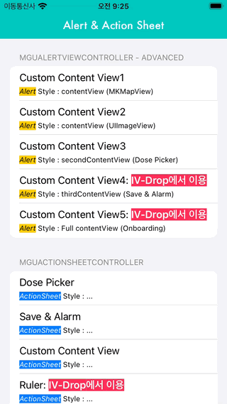
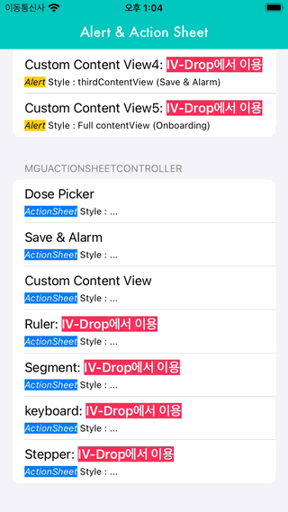
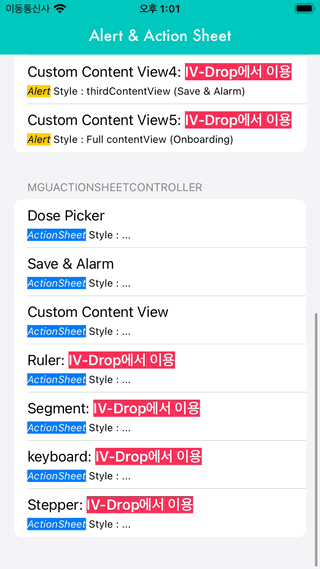
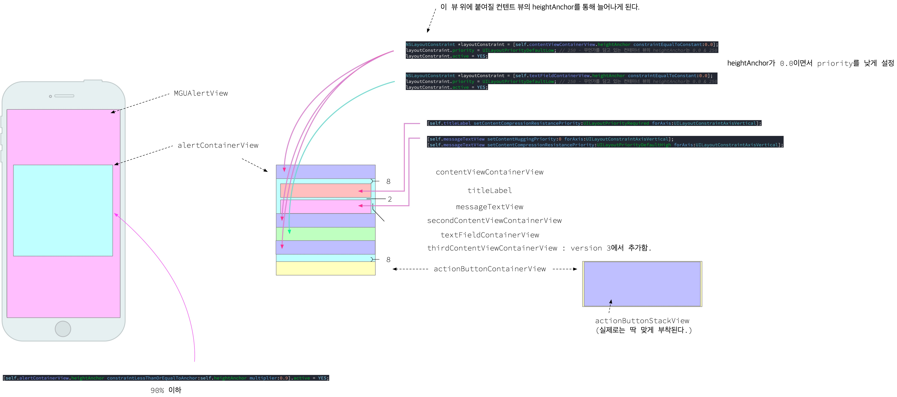

# Alert & Action Sheet 


<br/>


## **MGUAlertViewController** & **MGUActionSheetController** 
- `MGUNeoSegControl`는 `UISegmentedControl` 보다 더 많은 기능과 디자인의 자유도를 보장하는 커스텀 SegmentedControl
    - `UIControl` 서브클래스로 제작함
- [IV-Drop](https://apps.apple.com/app/id1574452904)을 만들면서 SheetViewController에 위치할 커스텀 SegmentedControl에 대한 요구사항이 있어서 제작함. [MiniTimer](https://apps.apple.com/app/id1618148240)에서도 사용함.
<p align="center"></p>


## Features
*  Colors, Gradients, Fonts 등 커스텀 가능
*  Style presets 지원
*  Supports texts and images
*  Text와 Image의 배치를 vertical 또는 horizontal로 배치가능
*  백그라운드 및 segment를 커스텀 뷰로 제공 가능
*  Haptic Feedback 제공 : 제스처로 토글 시 Haptic Feedback이 터치한 Device를 통해 전달된다.
    * `UIImpactFeedbackGenerator` 이용하여 구현함
*  **Swift** and **Objective-C** compatability
*  Written in Objective-C


## Preview
> - MGUNeoSegControl (iOS)
>   - [IV-Drop](https://apps.apple.com/app/id1574452904)을 만들면서 커스텀 스위치의 요구사항이 있어서 제작함.
>   - [MiniTimer](https://apps.apple.com/app/id1618148240)에서도 사용함.

MGUNeoSegControl (iOS) | [IV-Drop](https://apps.apple.com/app/id1574452904)에서 사용한 예 | [MiniTimer](https://apps.apple.com/app/id1618148240)에서 사용 예
---|---|---
||

[MiniTimer](https://apps.apple.com/app/id1618148240)에서 사용 예 |
---|
 |

## Presets and Styles
> - Transition Styles (`MGUAlertViewController`에서 `transitionStyle`은 iPhone, iPad 모두 동일하게 적용된다.)
>   - 전면부: `.fgFade`, `.fgSlideFromTop`, `.fgSlideFromTopRotation`, `.fgSlideFromBottom` 중 택 1
>   - 후면부: `.bgScale` 또는 none

$~$|`.fgFade`|`.fgSlideFromTop`|`.fgSlideFromTopRotation`|`.fgSlideFromBottom`
---|---|---|---|---
$~$||||
`.bgScale` ||||


---

> - Transition Styles (`MGUActionSheetController`에서 `transitionStyle`은 iPhone, iPad은 **다르게** 적용된다.)
>   - 아이폰: `.fgFade`, `.fgSlideFromBottom` 중 택 1
>   - 아이패드: 팝업 스타일로 자동 설정된다.

<table>
<thead>
  <tr>
    <th></th>
    <th colspan="2"><Strong>아이폰</Strong></th>
    <th>아이패드</th>
  </tr>
</thead>
<tbody>
  <tr>
    <td>Transition Style</td>
    <td align="center"><code>.fgFade</code></td>
    <td align="center"><code>.fgSlideFromBottom</code></td>
    <td align="center">팝업스타일로 자동 설정됨</td>
  </tr>
  <tr>
    <td></td>
    <td></td>
    <td></td>
    <td rowspan="2"></td>
  </tr>
  <tr>
    <td>Full Appearance</td>
    <td></td>
    <td></td>
  </tr>
</tbody>
</table>


## Usage

> Swift
```swift

let config = MGUNeoSegConfiguration.forge()
containerView.backgroundColor = config.backgroundColor
let segmentedControl = MGUNeoSegControl.init(titles: self.dropTitleAndImageModels(),
                                       selecedtitle: "",
                                      configuration: config)
view.addSubview(segmentedControl)
segmentedControl.addTarget(self, action: #selector(valueChanged(_:)), for: .valueChanged)
segmentedControl.impactOff = false

```

> Objective-C
```objective-c

MGUNeoSegControl *segmentedControl =
[[MGUNeoSegControl alloc] initWithTitles:[self imageModels]
                            selecedtitle:@"chrome"
                           configuration:[MGUNeoSegConfiguration iOS7Configuration]];
[self.view addSubview:segmentedControl];
[segmentedControl addTarget:self action:@selector(valueChanged:) forControlEvents:UIControlEventValueChanged];

```

## Documentation

- 컨텐츠 배치를 위한 설계도


## Author

sonkoni(손관현), isomorphic111@gmail.com 

## License

This project is released under the MIT License. See [LICENSE](https://github.com/sonkoni/Collection-of-Toy-Projects/blob/main/LICENSE) for more information.
