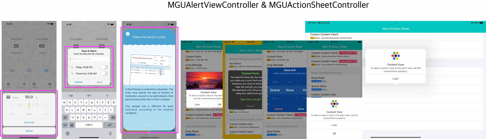

# Alert & Action Sheet 


<br/>


## **MGUAlertViewController** & **MGUActionSheetController**
- `MGUAlertViewController`, `MGUActionSheetController`는 `UIAlertController` 보다 더 많은 기능과 디자인의 자유도를 보장하는 커스텀 AlertController
    - `UIViewControllerTransitioningDelegate` 프로토콜을 따르는 `UIViewController` 서브클래스로 `MGUAlertViewController`를 제작함
        - `UIPresentationController`의 커스텀 서브클래스를 이용해 프르젠테이션의 초기 설정을 관할하게함
        - `UIViewControllerAnimatedTransitioning`을 따르는 커스텀 클래스를 이용하여 present 및 dismiss를 관할하는 객체를 구성함
    - `MGUActionSheetController`는 `MGUAlertViewController`의 서브클래스로 제작함
- [IV-Drop](https://apps.apple.com/app/id1574452904)을 만들면서 커스텀 AlertViewController 및 ActionSheetController의 요구사항이 있어서 제작함. 
<p align="center"></p>


## Features
*  Colors, Gradients, Fonts 등 커스텀 가능
*  Style presets 지원
*  Supports texts and images
*  Text와 Image의 배치를 vertical 또는 horizontal로 배치가능
*  백그라운드 및 segment를 커스텀 뷰로 제공 가능
* Transition Styles 제공 - [Presets and Styles](#presets-and-styles) 참고
    * `MGUAlertViewController`
        * Presented ViewController 에 대한 4가지 스타일 제공 
        * Presenting ViewController 에 대한 Scale Shrink 스타일 제공
    * `MGUActionSheetController`
        * iPhone 에서 Presented ViewController 에 대한 2가지 스타일 제공
        * iPad 에서 팝오버 스타일 제공
*  **Swift** and **Objective-C** compatability
*  Written in Objective-C


## Preview
> - MGUAlertViewController
>   - [IV-Drop](https://apps.apple.com/app/id1574452904)을 만들면서 커스텀 AlertViewController의 요구사항이 있어서 제작함.
>   - [MiniTimer](https://apps.apple.com/app/id1618148240)에서도 사용함.


No Button|Three Buttons|TextField|Custom Font|Long Message
:---:|:---:|:---:|:---:|:---:
||||
**Custom Content View**|**Custom Content View**|**Custom Content View**|**[IV-Drop](https://apps.apple.com/app/id1574452904)에서 사용**|**[IV-Drop](https://apps.apple.com/app/id1574452904) Onboarding**
||||


----

> - MGUActionSheetController
>   - [IV-Drop](https://apps.apple.com/app/id1574452904)을 만들면서 커스텀 ActionSheetController의 요구사항이 있어서 제작함.
>   - 아이패드에서는 Transition Style이  팝업 스타일로 자동 설정된다.


$~$|**[IV-Drop](https://apps.apple.com/app/id1574452904)에서 사용**|**[IV-Drop](https://apps.apple.com/app/id1574452904)에서 사용**|**[IV-Drop](https://apps.apple.com/app/id1574452904)에서 사용**|**[IV-Drop](https://apps.apple.com/app/id1574452904)에서 사용**
:---:|:---:|:---:|:---:|:---:
||||


<table>
<thead>
  <tr>
    <th colspan="2">아이패드에서 Preview</th>
  </tr>
</thead>
<tbody>
  <tr>
    <td></td>
    <td></td>
  </tr>
</tbody>
</table>


## Presets and Styles
> - Transition Styles (`MGUAlertViewController`에서 `transitionStyle`은 iPhone, iPad 모두 동일하게 적용된다.)
>   - 전면부: `.fgFade`, `.fgSlideFromTop`, `.fgSlideFromTopRotation`, `.fgSlideFromBottom` 중 택 1
>   - 후면부: `.bgScale` 또는 none

$~$|`.fgFade`|`.fgSlideFromTop`|`.fgSlideFromTopRotation`|`.fgSlideFromBottom`
---|---|---|---|---
$~$||||
`.bgScale` ||||


---


> - Transition Styles (`MGUActionSheetController`에서 `transitionStyle`은 iPhone, iPad은 **다르게** 적용된다.)
>   - 아이폰: `.fgFade`, `.fgSlideFromBottom` 중 택 1, configuration의 `isFullAppearance`를 `true`로 설정하면 꽉찬 모양으로 표기됨.
>   - 아이패드: 팝업 스타일로 자동 설정된다.

<table>
<thead>
  <tr>
    <th></th>
    <th colspan="2">아이폰</th>
    <th>아이패드</th>
  </tr>
</thead>
<tbody>
  <tr>
    <td>Transition Style</td>
    <td align="center"><code>.fgFade</code></td>
    <td align="center"><code>.fgSlideFromBottom</code></td>
    <td align="center">팝업스타일로 자동 설정됨</td>
  </tr>
  <tr>
    <td></td>
    <td></td>
    <td></td>
    <td rowspan="2"></td>
  </tr>
  <tr>
    <td>Full Appearance</td>
    <td></td>
    <td></td>
  </tr>
</tbody>
</table>


## Usage

> Swift
```swift

let title = "타이틀"
let message = "메시지"

let configuration = MGUAlertViewConfiguration()
configuration.transitionStyle = [.fgSlideFromTop, .bgScale]
configuration.backgroundTapDismissalGestureEnabled = true
configuration.swipeDismissalGestureEnabled = true
configuration.alwaysArrangesActionButtonsVertically = false

let okActionHandler = { (action: MGUAlertAction?) -> Void in
    print("Ok 버튼 눌렀음.")
}
let okAction = MGUAlertAction.init(title: "Ok", style: .default, handler: okActionHandler, configuration: nil)

let cancelActionHandler = { (action: MGUAlertAction?) -> Void in
    print("Cancel 버튼 눌렀음.")
}
let cancelAction = MGUAlertAction.init(title: "Cancel", style: .cancel, handler: cancelActionHandler, configuration: nil)
        
let alertViewController = MGUAlertViewController(configuration: configuration, title: title, message: message, actions: [okAction, cancelAction])
present(alertViewController, animated: true)

```

----

> Objective-C
```objective-c

NSString *title = @"타이틀";
NSString *message = @"메시지";

MGUAlertViewConfiguration *configuration = [MGUAlertViewConfiguration new];
configuration.transitionStyle = MGUAlertViewTransitionStyleFGSlideFromTop | MGUAlertViewTransitionStyleBGScale;
configuration.backgroundTapDismissalGestureEnabled = YES;
configuration.swipeDismissalGestureEnabled = YES;
configuration.alwaysArrangesActionButtonsVertically = NO;

void (^okActionHandler)(MGUAlertAction * _Nonnull) = ^(MGUAlertAction * _Nonnull action) { NSLog(@"Ok 버튼 눌렀음.");};
MGUAlertAction *okAction = [[MGUAlertAction alloc] initWithTitle:@"Ok"
                                                           style:UIAlertActionStyleDefault
                                                         handler:okActionHandler
                                                   configuration:nil];

void (^cancelActionHandler)(MGUAlertAction * _Nonnull) = ^(MGUAlertAction * _Nonnull action) { NSLog(@"Cancel 버튼 눌렀음.");};
MGUAlertAction *cancelAction = [[MGUAlertAction alloc] initWithTitle:@"Cancel"
                                                               style:UIAlertActionStyleCancel
                                                             handler:cancelActionHandler
                                                       configuration:nil];

MGUAlertViewController *alertViewController = [[MGUAlertViewController alloc] initWithConfiguration:configuration
                                                                                              title:title
                                                                                            message:message
                                                                                            actions:@[okAction, cancelAction]];
[self presentViewController:alertViewController animated:YES completion:nil];

```

## Documentation

- 컨텐츠 배치를 위한 설계도


- 위키 링크 넣자.

## Author

sonkoni(손관현), isomorphic111@gmail.com 

## License

This project is released under the MIT License. See [LICENSE](https://github.com/sonkoni/Collection-of-Toy-Projects/blob/main/LICENSE) for more information.
