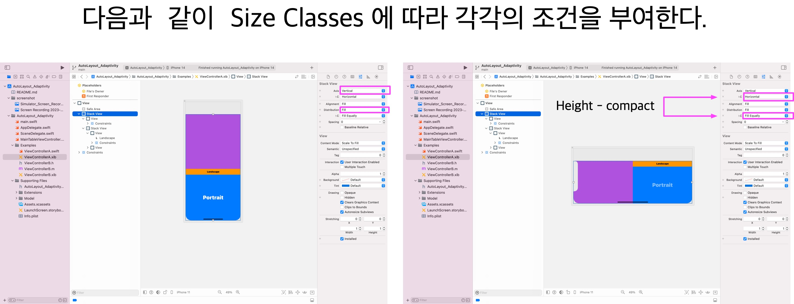

# AutoLayout Adaptivity 

## Device Size Classes 및 Orientation 에 따른 AutoLayout Adaptivity **테스트** 샘플
- Size classes (compact, regular)에 따른 AutoLayout Adaptivity : Swift Sample
- Orientation (Portrait, Landscape)에 따른 AutoLayout Adaptivity : Objective-C Sample
    
## Examples
> - Swift Sample
>   - Interface Builder based
>
> - Objective-C Sample
>   - Programmatically based

`Swift` |`Objective-C`
---|---
|    

## Documentation

- 여기에 존재하지 않는 추가적인 문서는 다음의 기술위키 문서를 참고하세요.
    - [자동회전](http://wiki.mulgrim.net/page/Project:IOs-ObjC/자동회전)
    - [오토레이아웃](http://wiki.mulgrim.net/page/Project:IOs-ObjC/오토레이아웃)
    - [콤팩트와_레귤러](http://wiki.mulgrim.net/page/Project:IOs-ObjC/콤팩트와_레귤러)
    - [intrinsicContentSize](http://wiki.mulgrim.net/page/Api:UIKit/UIView/intrinsicContentSize)
    - [뷰 전환](http://wiki.mulgrim.net/page/Project:Mac-ObjC/뷰_전환)


- Swift Sample : Interface Builder based


- snippets : Objective-C Programmatically based
```objective-c
- (void)viewDidLoad {
    [super viewDidLoad];
    [self configureTableView];
    [self configureDataSource];
    [self updateUI];
    __weak __typeof(self) weakSelf = self;
    NSNotificationCenter *notificationCenter = [NSNotificationCenter defaultCenter];
    self.observer = [notificationCenter addObserverForName:UIDeviceOrientationDidChangeNotification
                                                    object:nil
                                                     queue:[NSOperationQueue mainQueue]
                                                usingBlock:^(NSNotification *note) {
        if (weakSelf.presentedViewController == nil &&
            UIDeviceOrientationIsLandscape([UIDevice currentDevice].orientation) == YES) {
            ViewControllerX *vc = [ViewControllerX new];
            vc.modalPresentationStyle = UIModalPresentationFullScreen;
            vc.modalTransitionStyle = UIModalTransitionStyleCrossDissolve;
            [weakSelf presentViewController:vc animated:YES completion:^{}];
        }
    }];
}

```

## Bug
### System Bug
- iOS 16 이상의 Simulator부터는 `WKWebView` 이용 시 다음과 경고 로그가 발생한다.
    - [Apple Developer Forums](https://developer.apple.com/forums/thread/714467) 에 따르면 시스템 버그로 사료된다.
```
[Security] This method should not be called on the main thread as it may lead to UI unresponsiveness.
```


## Author

sonkoni(손관현), isomorphic111@gmail.com 

## License

This project is released under the MIT License. See [LICENSE](https://github.com/sonkoni/Collection-of-Toy-Projects/blob/main/LICENSE) for more information.
