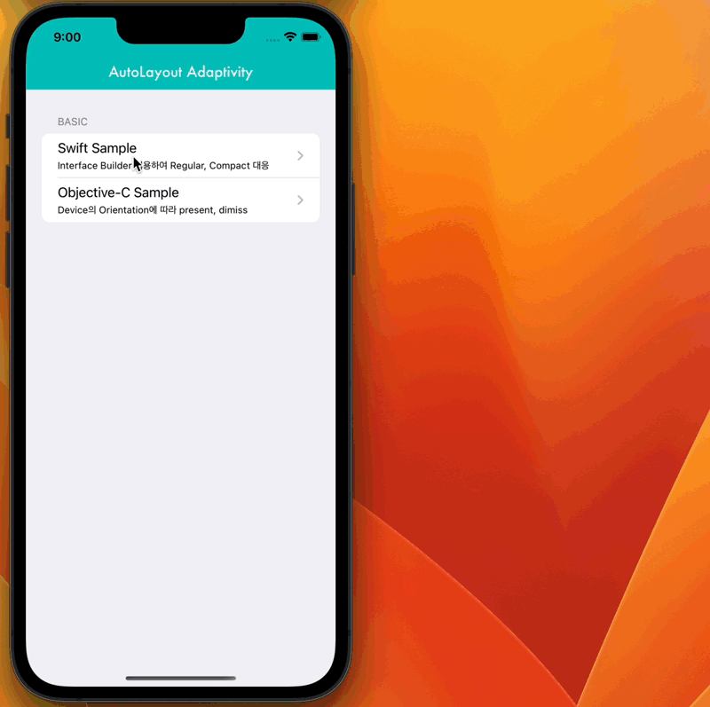
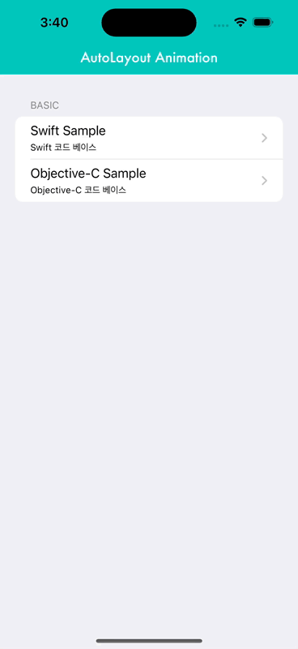

# AutoLayout Adaptivity 

## Device Size Classes 및 Orientation 에 따른 AutoLayout Adaptivity **테스트** 샘플
- AutoLayout의 변경 + `layoutIfNeeded` + UIView animation으로 작동한다.
    - 애니메이션 블락 내부에서 `layoutIfNeeded`를 호출해야한다. 
    
## 현재 테스트
## 💻 STACK


<br>


<br>


<br>


## Examples
> - Swift Sample
>
> - Objective-C Sample

`Swift`|```Objective-C```
---|---
|


## Documentation

- [Read the full **documentation** here](http://wiki.mulgrim.net/page/Api:UIKit/UIView/-_layoutIfNeeded)

```swift

@objc private func switchToggled(_ sender: UISwitch) {
    sender.isEnabled = false
    centerYConstraint.isActive = false
    if sender.isOn == true {
        centerYConstraint = targetView.centerYAnchor.constraint(equalTo: view.centerYAnchor)
        widthConstraint.constant = 100.0
    } else {
        centerYConstraint = targetView.centerYAnchor.constraint(equalTo: view.safeAreaLayoutGuide.bottomAnchor, constant: -50.0)
        widthConstraint.constant = 50.0
    }
    centerYConstraint.isActive = true
        
    let animator = UIViewPropertyAnimator(duration: 1.0, dampingRatio: 0.4) {
        self.view.layoutIfNeeded() // 애니메이션 블락 안에서 layoutIfNeeded 메서드를 호출해야한다. 
    }
    animator.addCompletion { _ in
        sender.isEnabled = true
    }
    animator.startAnimation()
}

```

## Bug
### System Bug
- `UISwitch` 토글 시 XCode 콘솔 상에서 발생하는 다음과 같은 메시지는 `UIKit` 버그에 해당한다.
```
invalid mode 'kCFRunLoopCommonModes' provided to CFRunLoopRunSpecific - break on _CFRunLoopError_RunCalledWithInvalidMode to debug. This message will only appear once per execution.
```
- [Apple Developer Forums](https://developer.apple.com/forums/thread/132035?answerId=416935022#416935022) 에서 애플의 엔지니어가 버그를 인정했다.
> Wow, that was depressingly easy to reproduce. I did a little digging and this is definitely a bug in UIKit, one that we’re tracking as (r. 57322394). The good news is that, AFAICT, it’s not actively toxic. CF is coping with this misbehaviour in a reasonable way.
>
> Share and Enjoy
>
>   —
>
> Quinn "The Eskimo!"
>
> Apple Developer Relations, Developer Technical Support, Core OS/Hardware
>  ```
>  let myEmail = "eskimo" + "1" + "@apple.com"
>  ```


## Author

sonkoni(손관현), isomorphic111@gmail.com 

## License

This project is released under the MIT License.
