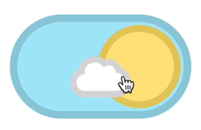
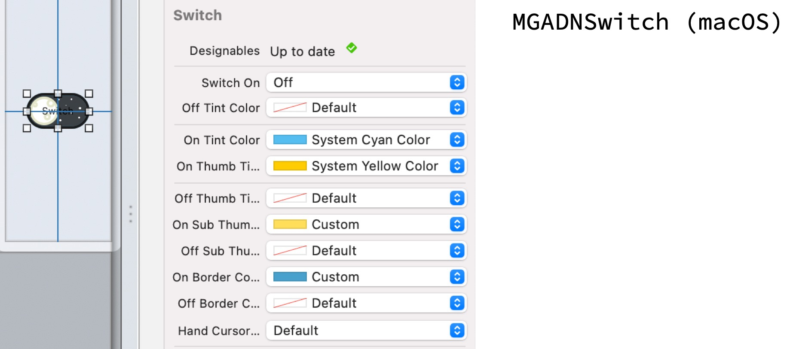

# DayNightSwitch 


<br/>


## **MGUDNSwitch** (***iOS***) <br/> **MGADNSwitch** (***macOS***)
- `DayNightSwitch`는 [Dribbble](https://dribbble.com/shots/1909289-Day-Night-Toggle-Button-GIF) 에서 발견한 스위치 디자인에 영감을 얻어 `UIControl`(iOS), `NSControl`(macOS)을 서브 클래싱하여 제작함. 
    - `MGUDNSwitch` : iOS 용 (`UIControl` 서브클래스)
    - `MGADNSwitch` : macOS 용 (`NSControl` 서브클래스)
- 유사 프로젝트 : [SevenSwitch](https://github.com/sonkoni/Collection-of-Toy-Projects/tree/main/Contents/SevenSwitch)
<p align="center"></p>

## Features
*  커스텀 사이즈 가능(`intrinsicContentSize`도 가지고 있음)
*  커스텀 Color 설정 가능
    * ON, OFF 각각의 상태에 대하여 보더, 백그라운드, 손잡이 색을 개별적으로 설정가능
*  Haptic Feedback 제공 : 제스처로 토글 시 Haptic Feedback이 터치한 Device(아이폰, 트랙패드 등)를 통해 전달된다.
    * iOS : `UIImpactFeedbackGenerator` 이용하여 구현함
    * macOS : `NSHapticFeedbackManager` 이용하여 구현함
*  제스처가 다 끝나지 않은 상태(손가락이 떨어지지 않은 상태)에서 ON, OFF를 오고가는 상태를 Notification 등록을 통해 감시 가능
    * iOS : `MGUDNSwitchStateChangedNotification` 을 이용하여 감시 가능함
    * macOS : `MGADNSwitchStateChangedNotification` 을 이용하여 감시 가능함
*  MGADNSwitch(macOS)는 마우스 hover 시에 커서 타입을 정할 수 있다.    
*  MGADNSwitch(macOS)는 Interface Builder에서 설정가능하다. - 그러나 XCode 자체 렌더링 버그가 있기 때문에 추천하지 않는다.
    * Swift : `@IBDesignable` `@IBInspectable`
    * Objective-C : `IB_DESIGNABLE` `IBInspectable`
*  **Swift** and **Objective-C** compatability
*  Support **iOS**(***MGUDNSwitch***) and **macOS**(***MGADNSwitch***).
*  Written in Objective-C


## Preview
> - MGUDNSwitch (iOS)
> - MGADNSwitch (macOS)

MGUDNSwitch (iOS) | MGADNSwitch (macOS)
---|---
|


## Usage

> Swift
```swift
//! iOS
let dayNightSwitch = MGUDNSwitch(center: view.center, switchOn: true, configuration: nil)
view.addSubview(dayNightSwitch)
dayNightSwitch.addTarget(self, action: #selector(switchValueChanged(_:)), for: .valueChanged)

//! macOS
let dayNightSwitch = MGADNSwitch(frame: .zero, switchOn: false, configuration: nil)
view.addSubview(dayNightSwitch)
dayNightSwitch.target = self
dayNightSwitch.action = #selector(switchValueChanged(_:))

```

> Objective-C
```objective-c
//! iOS
_dayNightSwitch = [[MGUDNSwitch alloc] initWithCenter:CGPointZero switchOn:YES configuration:nil];
[self.view addSubview:self.dayNightSwitch];
[self.dayNightSwitch addTarget:self action:@selector(switchValueChanged:) forControlEvents:UIControlEventValueChanged];

//! macOS
_dayNightSwitch = [[MGADNSwitch alloc] initWithFrame:NSZeroRect switchOn:NO configuration:nil];
[self.view addSubview:self.dayNightSwitch];
self.dayNightSwitch.target = self;
self.dayNightSwitch.action = @selector(switchValueChanged:);

```
> Interface Builder




## Documentation

>  * 7개의 별을 배치하는 알고리즘
>    
>  ```objective-c
>  - (void)setupStarViews { // 7개의 별을 나타낼 수 있게, 아주 작은 하얀색 뷰들을 다른 위치와 약간 다른 사이즈로 생성한다.
>      CGFloat w = self.frame.size.width;
>      CGFloat h = self.frame.size.height;
>      CGFloat x = h * 0.05; // 높이의 5%
>      UIView *s1 = [[UIView alloc] initWithFrame: CGRectMake(w * 0.50, h * 0.16, x,       x)];
>      UIView *s2 = [[UIView alloc] initWithFrame: CGRectMake(w * 0.62, h * 0.33, x * 0.6, x * 0.6)];
>      UIView *s3 = [[UIView alloc] initWithFrame: CGRectMake(w * 0.70, h * 0.15, x,       x)];
>      UIView *s4 = [[UIView alloc] initWithFrame: CGRectMake(w * 0.83, h * 0.39, x * 1.4, x * 1.4)];
>      UIView *s5 = [[UIView alloc] initWithFrame: CGRectMake(w * 0.70, h * 0.54, x * 0.8, x * 0.8)];
>      UIView *s6 = [[UIView alloc] initWithFrame: CGRectMake(w * 0.52, h * 0.73, x * 1.3, x * 1.3)];
>      UIView *s7 = [[UIView alloc] initWithFrame: CGRectMake(w * 0.82, h * 0.66, x * 1.1, x * 1.1)];
>      self.stars = @[s1, s2, s3, s4, s5, s6, s7];
>      for (UIView *star in self.stars) {
>          star.layer.masksToBounds = YES;
>          star.layer.cornerRadius  = star.frame.size.height / 2.0;
>          star.backgroundColor     = [UIColor whiteColor];
>          if (self.switchOn == YES) {
>              star.alpha = 0.0;
>          }
>          [self addSubview:star];
>      }
>  }
>  ```

>  * 7개의 별을 시간차를 두고 반짝이게 하는 알고리즘
>    
>  ```objective-c
>  for (int i = 0; i < self.stars.count; i++) {
>      
>      if(switchOn == YES) {
>          self.stars[i].alpha = 0.0;
>      } else {
>          self.stars[i].alpha = 1.0;
>      }
>      
>      dispatch_after(dispatch_time(DISPATCH_TIME_NOW, 0.1 * i * NSEC_PER_SEC), dispatch_get_main_queue(), ^{
>          self.stars[i].transform = CGAffineTransformMakeScale(1.5, 1.5);
>          dispatch_after(dispatch_time(DISPATCH_TIME_NOW, 0.05 * NSEC_PER_SEC), dispatch_get_main_queue(), ^{
>              self.stars[i].transform = CGAffineTransformIdentity;
>          });
>      });
>  }
>  
>  ```

<details> 
<summary>👇🖱️ border 애니메이션 알고리즘</summary>
<hr>

>  ```objective-c
>  //! border 애니메이션을 위해서는 start point가 각각 달라야한다.
>  - (UIBezierPath *)pathForLeftStartRoundRect:(CGRect)rect {
>      CGFloat width  = rect.size.width;
>      CGFloat height = rect.size.height;
>      CGFloat radius = rect.size.height / 2.0;
>      
>      UIBezierPath *path = [UIBezierPath bezierPath];
>      [path moveToPoint:CGPointMake(0, radius)];
>      [path addArcWithCenter:CGPointMake(radius, radius) radius:radius startAngle:M_PI endAngle:-M_PI_2 clockwise:YES];
>      [path addLineToPoint:CGPointMake(width - radius, 0)];
>      [path addArcWithCenter:CGPointMake(width - radius, radius) radius:radius startAngle:-M_PI_2 endAngle:0 clockwise:YES];
>      [path addArcWithCenter:CGPointMake(width - radius, height - radius) radius:radius startAngle:0 endAngle:M_PI_2 clockwise:YES];
>      [path addLineToPoint:CGPointMake(radius, height)];
>      [path addArcWithCenter:CGPointMake(radius, height - radius) radius:radius startAngle:M_PI_2 endAngle:M_PI clockwise:YES];
>      return path;
>      //
>      // CGPath로 쌩으로 만들 수도 있다.
>      // 좌측에서 시작하여 시계방향으로 도는 path이다.
>  }
>  
>  - (UIBezierPath *)pathForRightStartRoundRect:(CGRect)rect {
>      CGFloat width  = rect.size.width;
>      CGFloat height = rect.size.height;
>      CGFloat radius = rect.size.height / 2.0;
>      
>      UIBezierPath *path = [UIBezierPath bezierPath];
>      [path moveToPoint:CGPointMake(width, radius)];
>      [path addArcWithCenter:CGPointMake(width - radius, height - radius) radius:radius startAngle:0 endAngle:M_PI_2 clockwise:YES];
>      [path addLineToPoint:CGPointMake(radius, height)];
>      [path addArcWithCenter:CGPointMake(radius, height - radius) radius:radius startAngle:M_PI_2 endAngle:M_PI clockwise:YES];
>      [path addArcWithCenter:CGPointMake(radius, radius) radius:radius startAngle:M_PI endAngle:-M_PI_2 clockwise:YES];
>      [path addLineToPoint:CGPointMake(width - radius, 0)];
>      [path addArcWithCenter:CGPointMake(width - radius, radius) radius:radius startAngle:-M_PI_2 endAngle:0 clockwise:YES];
>      return [path bezierPathByReversingPath];
>      //
>      // 감춰진 상태에서 시계방향으로 보여줄려고한다. start Point로만 조작하려고 한다.(애니메이션에서 startStoke endStorke 둘다 쓰는 것은 번거롭다.)
>      // 우측에서 반시계방향으로 돌아 만들어진 path이다. (왜냐하면 다음줄에서 reverse하므로.)
>  }
>  ```

</details>

## Author

sonkoni(손관현), isomorphic111@gmail.com


## Credits

Inspired by Dribbble [post](https://dribbble.com/shots/1909289-Day-Night-Toggle-Button-GIF)
 

## License

This project is released under the MIT License. See [LICENSE](https://github.com/sonkoni/Collection-of-Toy-Projects/blob/main/LICENSE) for more information.
