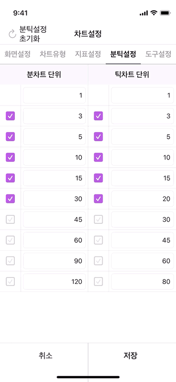
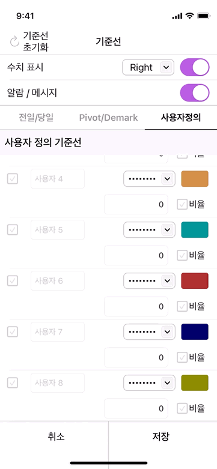
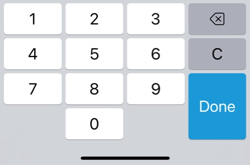
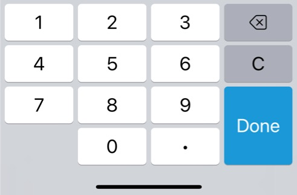
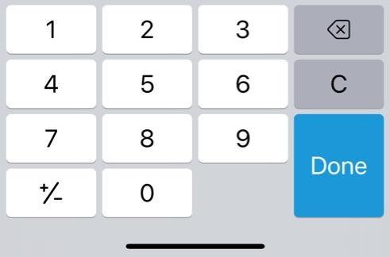
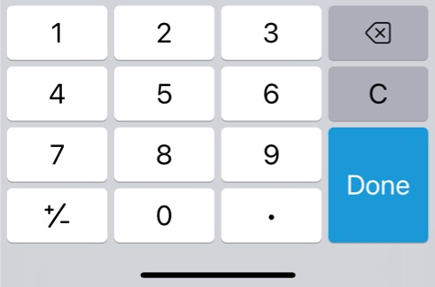

# FinancialKeyboard 


<br/>


## **SKUFinancialKeyboard** & **MGUFinancialKeyboard**
> - MGUFinancialKeyboard
>   - MGUFinancialTextField 와 연동
>   - Written in **Objective-C**, **Swift** and **Objective-C** compatability
> - SKUFinancialKeyboard
>   - SKUFinancialTextField 와 연동
>   - Written in **Swift**

- `TextField` 와 반응하여 숫자 및 특정 기호를 입력받을 수 있는 커스텀 Number Keyboard
- `UIInputView` 를 기반으로 제작함
- [MTS 프로젝트](https://www.youtube.com/playlist?list=PLFPYBBPL_u8oSMkmvaVAF8Gg3Uhb4dOWG)를 진행하면서 증권사 앱에서 사용되는 text field에 반응하는 **Number Keyboard**에 대한 요구사항이 있어서 제작함.
<p align="center"></p>

## Features
*  범위 설정 지원
    * `@property (nonatomic, assign) CGFloat maxDataValue;`
    * 범위 초과 시 `alertMessage` 설정가능
*  Style presets 지원
    * `.none`
    * `.dot` ~ floating value
    * `.pm` ~ sign/unsign
    * `.dotPm` ~ floating value + sign/unsign    
* Sound 지원
    * `[[UIDevice currentDevice] playInputClick];`
* Delete 버튼 long press 지원
    * long press 시, 일정한 간격으로 반복적으로 호출되어 실행된다.
* MGUFinancialKeyboard
    * Written in **Objective-C**, **Swift** and **Objective-C** compatability
* SKUFinancialKeyboard
    * Written in **Swift**


## Preview
> - SKUFinancialKeyboard (Written in Swift), MGUFinancialKeyboard (Written in Objective-C, **Swift** and **Objective-C** compatability)
>   - [MTS 프로젝트](https://www.youtube.com/playlist?list=PLFPYBBPL_u8oSMkmvaVAF8Gg3Uhb4dOWG)를 진행하면서 증권사 앱에서 사용되는 **Number Keyboard**에 대한 요구사항이 있어서 제작함.

`.none` | `.dot`
---|---
 | 

## Presets and Styles
> - Built-in configuration
>     - `SKUFinancialKeyboard.BtnOptions`

`.none`|`.dot`|`.pm`|`.dotPm`
---|---|---|---
 |||

## Usage

> Swift
```swift

textField = SKUFinancialTextField()
textField.buttonOptions = .none
textField.maxDataValue = 3000.0
textField.alertMessage = "1 이상 3,000 이하의 숫자만 유효합니다."
textField.completionClosure = { [weak self] (dataValue: Double) -> Void in
    let result = min(max(1.0, dataValue), 3000.0)
    let finalResult = lround(result)
    self?.textField.dataValue = result;
    print("finalResult ==> \(finalResult)")
}
textField.dataValue = 50.0

```

----

> Objective-C
```objective-c

self.textField = [MGUFinancialTextField new];
self.textField.buttonOptions = MGUFinancialKeyboardBtnOptionsNone;
    
self.textField.maxDataValue = 3000.0;
self.textField.alertMessage = @"1 이상 3,000 이하의 숫자만 유효합니다.";
__weak __typeof(self.textField) weakTextField = self.textField;
self.textField.completionBlock = ^(CGFloat dataValue) {
    CGFloat result = MIN(MAX(1.0, dataValue), 3000.0);
    NSInteger finalResult = lround(result);
    weakTextField.dataValue = result;
    NSLog(@"finalResult ==> %ld", finalResult);
};
self.textField.dataValue = 50.0;

```

## Documentation
* 만약 TextField가 `UITableViewCell` 위에 존재할때 Offset을 조정해야할 상황이 발생할 수 있다.
    * 키보드가 등장했을 때, TextField를 가릴 수 있는 상황에서는 Offset을 조정하여 사용자 경험을 해치지 않아야한다.
    
```swift

func setupKeyboardObserver() {
    let nc = NotificationCenter.default
    weak var weakSelf = self
    showObserver = nc.addObserver(forName: UIResponder.keyboardWillShowNotification,
                                  object: nil,
                                  queue: OperationQueue.main) { note in
        weakSelf?.showKeyboard = true
        weakSelf?.handleKeyboardNotification(note)
    }

    hideObserver = nc.addObserver(forName: UIResponder.keyboardWillHideNotification,
                                  object: nil,
                                  queue: OperationQueue.main) { note in
        weakSelf?.showKeyboard = false
        weakSelf?.handleKeyboardNotification(note)
    }
}

func handleKeyboardNotification(_ notification: Notification?) {
        
    guard let visibleCells = self.tableView.visibleCells as? [FTableViewCell],
          let userInfo = notification?.userInfo,
          let name = notification?.name,
          let keyboardFrame = userInfo[UIResponder.keyboardFrameEndUserInfoKey] as? CGRect
    else {
        return
    }
    let cell = visibleCells.first { cell in
        if cell.minField.isFocusState {
            return true
        } else {
            return false
        }
    }
    self.currentTextField = cell?.minField
        
    let previousNotificationName = self.previousNotificationName
    let previousKeyboardHeight = self.previousKeyboardHeight
    self.previousNotificationName = name
    
    let keyboardHeight = keyboardFrame.height
    self.previousKeyboardHeight = keyboardHeight

    if previousNotificationName == name && previousKeyboardHeight == keyboardHeight {
        return
    }
        
    guard let animationCurve = userInfo[UIResponder.keyboardAnimationCurveUserInfoKey] as? UInt,
          let duration = userInfo[UIResponder.keyboardAnimationDurationUserInfoKey] as? Double
          else {
              return
    }

    let options = UIView.AnimationOptions(rawValue: animationCurve << 16) // Convert the animation

    if name == UIResponder.keyboardWillHideNotification {
        let originalMaxOffsetY = self.tableView.skhMaxOffset().y - self.tableView.contentInset.bottom
        let originalMaxOffsetYClamped = max(0.0, originalMaxOffsetY)
        if originalMaxOffsetYClamped < self.tableView.contentOffset.y {
            UIViewPropertyAnimator.runningPropertyAnimator(
                withDuration: duration,
                delay: 0.0,
                options: options,
                animations: {
                self.tableView.setContentOffset(CGPoint(x: 0.0, y: originalMaxOffsetYClamped), animated: false)
                self.view.layoutIfNeeded()
            }, completion: { _ in
                self.tableView.contentInset = .zero
                self.tableView.scrollIndicatorInsets = .zero
            })
        } else {
            self.tableView.contentInset = .zero
            self.tableView.scrollIndicatorInsets = .zero
        }
        return
    }

    if name == UIResponder.keyboardWillShowNotification {
        let bottomInset = keyboardHeight - self.view.safeAreaInsets.bottom
        self.tableView.contentInset = UIEdgeInsets(top: 0.0, left: 0.0, bottom: bottomInset, right: 0.0)
        self.tableView.scrollIndicatorInsets = UIEdgeInsets(top: 0.0, left: 0.0, bottom: bottomInset, right: 0.0)
    }

    if let textField = currentTextField,
       let window = textField.window {
        let rect = textField.convert(textField.bounds, to: window)
        let upLength = rect.origin.y + rect.size.height + 4.0
        let total = upLength + keyboardHeight
        var movingOffset = self.tableView.contentOffset
        if total > window.bounds.size.height {
            let move = abs(window.bounds.size.height - total)
            movingOffset = CGPoint(x: movingOffset.x, y: movingOffset.y + move)
        }

        UIViewPropertyAnimator.runningPropertyAnimator(withDuration: duration, delay: 0.0, options: options, animations: {
            self.tableView.setContentOffset(movingOffset, animated: false)
            self.view.layoutIfNeeded()
        }, completion: nil)
    }
}

```

## Author

sonkoni(손관현), isomorphic111@gmail.com 

## License

This project is released under the MIT License. See [LICENSE](https://github.com/sonkoni/Collection-of-Toy-Projects/blob/main/LICENSE) for more information.
