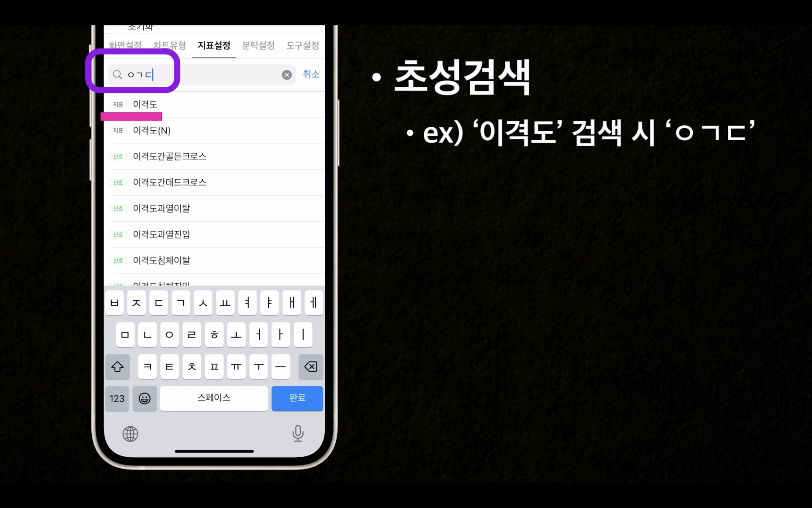
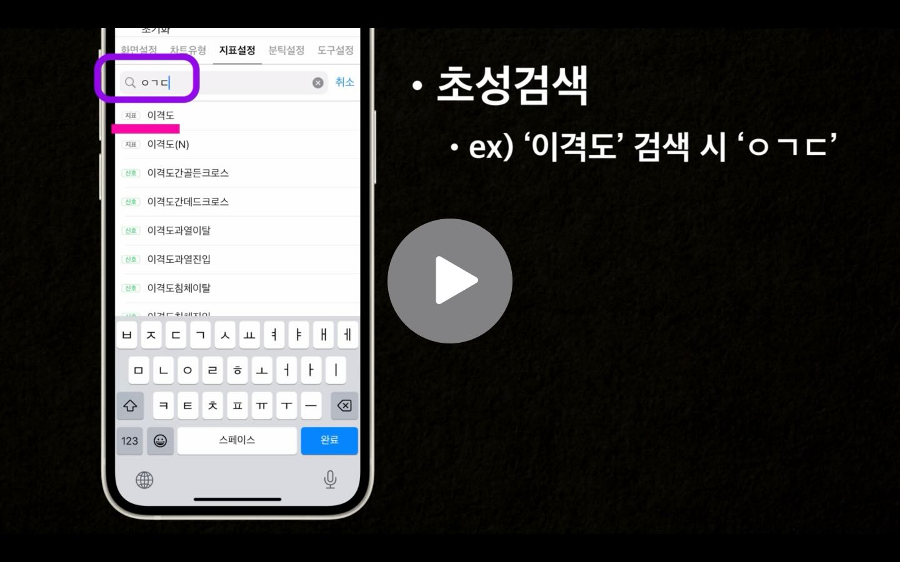

# Initial Consonant Search Samples - 초성검색


<br/>


## MGRJamo (***Objective-C***) <br/> SKHJamo (***Swift***)
> - MGRJamo
>   - UTF-8 기준의 Objective-C용 한글 자모 분해 라이브러리
>   - Written in **Objective-C**, **Swift** and **Objective-C** compatability
> - SKHJamo
>   - UTF-8 기준의 Swift용 한글 자모 분해 라이브러리
>   - Written in **Swift**

- 텍스트 필드를 사용해서 검색을 구현할 시 한글 자음과 모음을 분리해서도, 합쳐서도 필터링이 되게 한다.
    ```
    - "이격도" 라는 텍스트를 검색한다 ->
        - 이격도 라는 글자 + "ㅇ, 이, 익, 이격, 이격ㄷ, 이격도, ㅇㄱㄷ" 까지도 검색이 되게 하려면 다음을 이용한다
    ```

- [MTS 프로젝트](https://youtu.be/161FoZYpU8I?si=z89zAGR5vfeHqILa&t=90)를 진행하면서 **초성검색**에 대한 요구사항이 있어서 제작함.
- 추가적으로 **Debounce** 기능을 추가할 수 있으나, 자료의 양이 많지 않을 경우(경험상 1000개 이하)는 생략하는 것이 UX상 더 나은 것으로 사료된다.
 
[<p align="center"></p>](https://youtu.be/161FoZYpU8I?si=rsnyjAQHsTWMouqp&t=94)


## Preview
> - 관련동영상

[<p align="left"></p>](https://youtu.be/161FoZYpU8I?si=rsnyjAQHsTWMouqp&t=94)

## Usage

> Swift
```swift

let word = "이격도"
let jamo = SKHJamo.getJamo(word)

// "ㅇㅣㄱㅕㄱㄷㅗ"

```

> Objective-C
```objective-c

    
NSString *word = @"이격도";
NSString *jamo = [MGRJamo getJamo:word];
  
// "ㅇㅣㄱㅕㄱㄷㅗ"

```

## Documentation

> - SKHJamo.swift
>   - 한글 자음과 모음의 분리를 처리 (MGRJamo.h, MGRJamo.m 파일은 생략함)
 
```swift

import Foundation

extension CharacterSet{
    static var modernHangul: CharacterSet{
        return CharacterSet(charactersIn: ("가".unicodeScalars.first!)...("힣".unicodeScalars.first!))
    }
}

public class SKHJamo {
    
    // UTF-8 기준
    static let INDEX_HANGUL_START:UInt32 = 44032  // "가"
    static let INDEX_HANGUL_END:UInt32 = 55203    // "힣"
    
    static let CYCLE_CHO :UInt32 = 588
    static let CYCLE_JUNG :UInt32 = 28
    
    static let CHO = [
        "ㄱ","ㄲ","ㄴ","ㄷ","ㄸ","ㄹ","ㅁ","ㅂ","ㅃ","ㅅ",
        "ㅆ","ㅇ","ㅈ","ㅉ","ㅊ","ㅋ","ㅌ","ㅍ","ㅎ"
    ]
    
    static let JUNG = [
        "ㅏ", "ㅐ", "ㅑ", "ㅒ", "ㅓ", "ㅔ","ㅕ", "ㅖ", "ㅗ", "ㅘ",
        "ㅙ", "ㅚ","ㅛ", "ㅜ", "ㅝ", "ㅞ", "ㅟ", "ㅠ", "ㅡ", "ㅢ",
        "ㅣ"
    ]
    
    static let JONG = [
        "","ㄱ","ㄲ","ㄳ","ㄴ","ㄵ","ㄶ","ㄷ","ㄹ","ㄺ",
        "ㄻ","ㄼ","ㄽ","ㄾ","ㄿ","ㅀ","ㅁ","ㅂ","ㅄ","ㅅ",
        "ㅆ","ㅇ","ㅈ","ㅊ","ㅋ","ㅌ","ㅍ","ㅎ"
    ]
    
    static let JONG_DOUBLE = [
        "ㄳ":"ㄱㅅ","ㄵ":"ㄴㅈ","ㄶ":"ㄴㅎ","ㄺ":"ㄹㄱ","ㄻ":"ㄹㅁ",
        "ㄼ":"ㄹㅂ","ㄽ":"ㄹㅅ","ㄾ":"ㄹㅌ","ㄿ":"ㄹㅍ","ㅀ":"ㄹㅎ",
        "ㅄ":"ㅂㅅ"
    ]
    
    static let MO = [
        "ㅘ":"ㅏ", "ㅙ":"ㅐ", "ㅚ":"ㅣ", "ㅝ":"ㅓ", "ㅞ":"ㅔ", "ㅟ":"ㅣ", "ㅢ":"ㅣ"
    ]
        
    static let MO_LIST = [
        "ㅘ", "ㅙ", "ㅚ", "ㅝ", "ㅞ", "ㅟ", "ㅢ"
    ]
        
    static let JA = [
        "ㄱ":2, "ㄲ":4, "ㄴ":2, "ㄷ":3, "ㄸ":6,
        "ㄹ":5, "ㅁ":4, "ㅂ":4, "ㅃ":8, "ㅅ":2,
        "ㅆ":4, "ㅇ":1, "ㅈ":3, "ㅉ":6, "ㅊ":4,
        "ㅋ":3, "ㅌ":4, "ㅍ":4, "ㅎ":3, "ㅏ":2,
        "ㅐ":3, "ㅑ":3, "ㅒ":4, "ㅓ":2, "ㅔ":3,
        "ㅕ":3, "ㅖ":4, "ㅗ":2, "ㅘ":4, "ㅙ":5,
        "ㅚ":3, "ㅛ":3, "ㅜ":2, "ㅝ":4, "ㅞ":5,
        "ㅟ":3, "ㅠ":3, "ㅡ":1, "ㅢ":2, "ㅣ":1,
        "ㄳ":4, "ㄵ":5, "ㄶ":5, "ㄺ":7, "ㄻ":9,
        "ㄼ":9, "ㄽ":7, "ㄾ":9, "ㄿ":9, "ㅀ":8,
        "ㅄ":6
    ]
    
    // 주어진 "코드의 음절"을 자모음으로 분해해서 리턴하는 함수
    private class func getJamoFromOneSyllable(_ n: UnicodeScalar) -> String?{
        if CharacterSet.modernHangul.contains(n){
            let index = n.value - INDEX_HANGUL_START
            let cho = CHO[Int(index / CYCLE_CHO)]
            let jung = JUNG[Int((index % CYCLE_CHO) / CYCLE_JUNG)]
            var jong = JONG[Int(index % CYCLE_JUNG)]
            if let disassembledJong = JONG_DOUBLE[jong] {
                jong = disassembledJong
            }
            return cho + jung + jong
        }else{
            return String(UnicodeScalar(n))
        }
    }
    
    // 주어진 "코드의 음절"중 초성을 분해해서 리턴하는 함수
    private class func getChoFromOneSyllable(_ n: UnicodeScalar) -> String?{
        if CharacterSet.modernHangul.contains(n){
            let index = n.value - INDEX_HANGUL_START
            let cho = CHO[Int(index / CYCLE_CHO)]
            return cho
        } else {
            return String(UnicodeScalar(n))
        }
    }
}

extension SKHJamo {
    
    // 주어진 "단어"를 자모음으로 분해해서 리턴하는 함수
    class func getJamo(_ input: String) -> String {
        var jamo = ""
        //let word = input.trimmingCharacters(in: .whitespacesAndNewlines).trimmingCharacters(in: .punctuationCharacters)
        for scalar in input.unicodeScalars{
            jamo += getJamoFromOneSyllable(scalar) ?? ""
        }
        return jamo
    }
    
    class func getJamoList(_ input: String) -> [String] {
        var jamos: [String] = []
        //let word = input.trimmingCharacters(in: .whitespacesAndNewlines).trimmingCharacters(in: .punctuationCharacters)
        for scalar in input.unicodeScalars{
            jamos.append(getJamoFromOneSyllable(scalar) ?? "")
        }
        return jamos
    }
    
    // 주어진 "단어"를 초성만 가져와서 리턴하는 함수
    class func getCho(_ input: String) -> String {
        var jamo = ""
        //let word = input.trimmingCharacters(in: .whitespacesAndNewlines).trimmingCharacters(in: .punctuationCharacters)
        for scalar in input.unicodeScalars{
            jamo += getChoFromOneSyllable(scalar) ?? ""
        }
        return jamo
    }
    
    class func getDanmo(_ input: Character) -> Character {
        for (key, value) in MO {
            if key == "\(input)" {
                return Character(value)
            }
        }
        return input
    }
    
    //이전 입력한 내용과 비교해서 삭제인지 추가 입력인지 확인하는 함수
    class func isDanmoDelete(preInputList: [String], inputList: [String]) -> Bool {
        var preCount = 0
        var curCount = 0
        
        for text in preInputList {
            for (key, value) in JA {
                if text == key  {
                    preCount += value
                    break
                }
            }
        }
        
        for text in inputList {
            for (key, value) in JA {
                if text == key {
                    curCount += value
                    break
                }
            }
        }
        
        if curCount < preCount {
            return true
        }
        return false
    }
}

```

> - String+Extension.swift

```swift

import Foundation

public extension String {

    func mgrRange<T>(
        of searchString: T,
        options mask: String.CompareOptions = [],
        range searchRange: Range<Self.Index>? = nil,
        locale: Locale? = nil
    ) -> NSRange where T : StringProtocol {
        var searchString = searchString.trimmingCharacters(in: .whitespaces) // 양끝 트리밍
        let result = self.range(of: searchString, options: mask, range: searchRange, locale: locale)
        if let result = result {
            let loc = result.lowerBound.utf16Offset(in: self)
            let len = result.upperBound.utf16Offset(in: self) - loc
            return NSMakeRange(loc, len)
        }
        var selfString = SKHJamo.getJamo(self)
        searchString = SKHJamo.getJamo(searchString)
        var range = selfString.range(of: searchString, options: mask, range: searchRange, locale: locale)
        if let range = range {
            let loc = range.lowerBound.utf16Offset(in: selfString)
            let len = range.upperBound.utf16Offset(in: selfString) - loc
            return NSMakeRange(loc, len)
        }
        selfString = SKHJamo.getCho(self)
        /// searchString = SKHJamo.getCho(searchString) // 이건 완전히 이미 분해되었음.(∵) 기존에 완전히 분해했으므로.
        range = selfString.range(of: searchString, options: mask, range: searchRange, locale: locale)
        if let range = range {
            let loc = range.lowerBound.utf16Offset(in: selfString)
            let len = range.upperBound.utf16Offset(in: selfString) - loc
            return NSMakeRange(loc, len)
        }
        return NSRange(location: NSNotFound, length: 0)
    }
    
}

```

## Author

sonkoni(손관현), isomorphic111@gmail.com 

## License

This project is released under the MIT License. See [LICENSE](https://github.com/sonkoni/Collection-of-Toy-Projects/blob/main/LICENSE) for more information.
