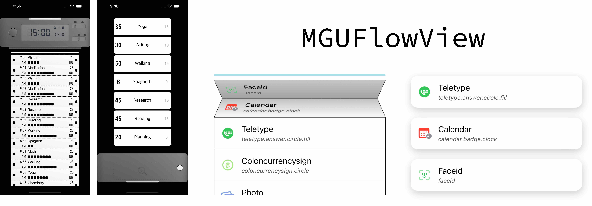

# MGUFlowView 


<br/>


## **MGUFlowView**
- 손가락으로 휠을 돌려서 입력값을 설정할 수 있는 다이얼 컨트롤
    - `UIControl` 를 기반으로 제작함
- [MiniTimer](https://apps.apple.com/app/id1618148240)를 만들면서 휠을 돌려서 입력값을 설정할 수 있는 다이얼 컨트롤에 대한 요구사항 이 있어서 제작함.
<p align="center"></p>


## Features
*  휠의 회전으로 입력값을 설정 가능케 함
    * 손잡이 부분이 아니라도 휠 반경 전체에서 제스처 동작이 시작될 수 있음
*  제스처가 시작되고 중심으로부터 일정한 Radius를 벗어나면 제스처를 disable 시켜서 오작동을 방지함    
*  Sound 지원
    * 휠이 돌아가면서 값이 변화할 때마다 사용자에게 Feedback을 줄 수 있는 Sound 설정가능 
    * Sound Source는 Simulator에서 추출함     
*  **Swift** and **Objective-C** compatability


## Preview
> - DialControl (iOS)
>   - [MiniTimer](https://apps.apple.com/app/id1618148240)를 만들면서 휠을 돌려서 입력값을 설정할 수 있는 다이얼 컨트롤에 대한 요구사항 이 있어서 제작함.


Sample 1 | Sample 2 | [MiniTimer](https://apps.apple.com/app/id1618148240)에서 사용 예
---|---|---
||


## Usage

> Swift
```swift

sound = MGOSoundRuler.rulerSound
let dialControl = MMTDialControl()
dialControl.normalSoundPlayBlock = sound?.playSoundTickHaptic()
view.addSubview(dialControl)
dialControl.addTarget(self, action:#selector(dialValueChanged(_:)), for: .valueChanged)

```

> Objective-C
```objective-c

sound = [MGOSoundRuler rulerSound];
MMTDialControl *dialControl = [MMTDialControl new];
dialControl.normalSoundPlayBlock = [sound playSoundTickHaptic];
[self.view addSubview:dialControl];
[dialControl addTarget:self action:@selector(dialValueChanged:) forControlEvents:UIControlEventValueChanged];

```

## Documentation

- DialControl의 Behavior를 위한 설계도


## Author

sonkoni(손관현), isomorphic111@gmail.com 

## License

This project is released under the MIT License. See [LICENSE](https://github.com/sonkoni/Collection-of-Toy-Projects/blob/main/LICENSE) for more information.
