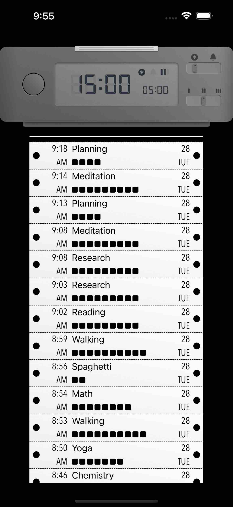
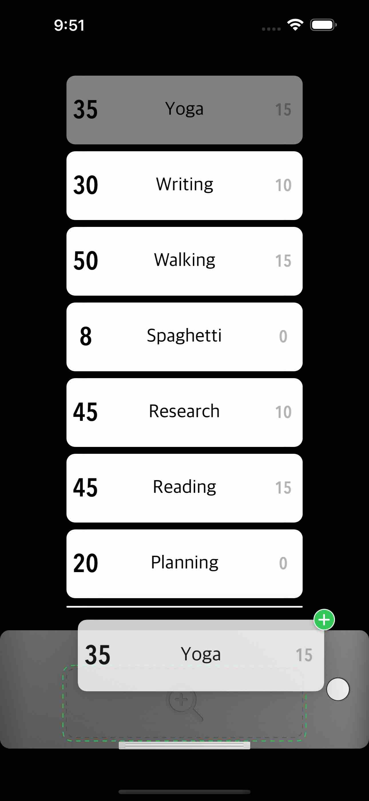

# MGUFlowView 


<br/>


## **MGUFlowView**
- 스크롤 시 접히는 종이처럼 접히는 Layout과 역순(아래에서 부터) 정렬 가능하며 말단에서 말려들어가는 Layout을 지원하는 Table View를 대체할 수 있는 Component  
    - `UICollectionViewLayout`, `UICollectionViewLayoutAttributes` 를 서브클래싱하여 제작함
- [MiniTimer](https://apps.apple.com/app/id1618148240)를 만들면서 종이처럼 접히는 레이아웃의 테이블 뷰 및 역순으로 정렬되는 테이블뷰를 요청하여 제작함.
<p align="center"></p>

 | Vega Style | Vega Style - Reverse
## Features
*  독특한 레이아웃 지원
    * Folding Style: 스크롤 시 종이처럼 접히는 레이아웃 
    * Vega Style: 스크롤 시 끝단에서 말리는 레이아웃 제공
        * reverse order 기능 존재함. 아이템이 아래에서부터 차오른다. - [Preview](#preview) 참고.
*  휠의 회전으로 입력값을 설정 가능케 함
    * 손잡이 부분이 아니라도 휠 반경 전체에서 제스처 동작이 시작될 수 있음
*  제스처가 시작되고 중심으로부터 일정한 Radius를 벗어나면 제스처를 disable 시켜서 오작동을 방지함    
*  Sound 지원
    * 휠이 돌아가면서 값이 변화할 때마다 사용자에게 Feedback을 줄 수 있는 Sound 설정가능 
    * Sound Source는 Simulator에서 추출함
*  Interface Builder에서 설정가능 - 그러나 XCode 자체 렌더링 버그가 있기 때문에 추천하지 않는다.
    * Swift : `@IBDesignable` `@IBInspectable`
    * Objective-C : `IB_DESIGNABLE` `IBInspectable`         
*  **Swift** and **Objective-C** compatability


## Preview
> - MGUFlowView (iOS)
>   - [MiniTimer](https://apps.apple.com/app/id1618148240)를 만들면서 종이처럼 접히는 레이아웃의 테이블 뷰 및 역순으로 정렬되는 테이블뷰를 요청하여 제작함.


Folding Style | Vega Style | Vega Style - Reverse
---|---|---
||

[MiniTimer](https://apps.apple.com/app/id1618148240)에서 사용 예 1 | [MiniTimer](https://apps.apple.com/app/id1618148240)에서 사용 예 2 | [MiniTimer](https://apps.apple.com/app/id1618148240) 앱 Screenshot 1 | [MiniTimer](https://apps.apple.com/app/id1618148240) 앱 Screenshot 2 
---|---|---|---
|||


## Usage

> Swift
```swift

let width = UIScreen.main.bounds.width - (2 * 20.0)
let itemSize = CGSize(width: width, height: 65.0)
let flowView = MGUFlowView()
self.itemSize = itemSize
self.flowView = flowView
flowView.register(MGUFlowFoldCell.self, forCellWithReuseIdentifier: NSStringFromClass(MGUFlowFoldCell.self))
flowView.register(MGUFlowIndicatorSupplementaryView.self,
                   forSupplementaryViewOfKind: MGUFlowElementKindFold.leading.rawValue,
                   withReuseIdentifier: MGUFlowElementKindFold.leading.rawValue)
        
flowView.itemSize = itemSize
flowView.leadingSpacing = 20.0
flowView.interitemSpacing = 0.0
flowView.scrollDirection = .vertical
flowView.decelerationDistance = MGUFlowView.automaticDistance
flowView.transformer = nil
flowView.delegate = self
flowView.bounces = true
flowView.alwaysBounceVertical = true
flowView.clipsToBounds = true
let transformer = MGUFlowFoldTransformer()
flowView.transformer = transformer
view.addSubview(flowView)

```

> Objective-C
```objective-c

CGFloat width = UIScreen.mainScreen.bounds.size.width - (2 * 20.0);
self->_itemSize = CGSizeMake(width, 65.0);

self.flowView  = [MGUFlowView new];
[self.flowView registerClass:[MGUFlowFoldCell class]
      forCellWithReuseIdentifier:NSStringFromClass([MGUFlowFoldCell class])];
    
[self.flowView registerClass:[MGUFlowIndicatorSupplementaryView class]
  forSupplementaryViewOfKind:MGUFlowElementKindFoldLeading
         withReuseIdentifier:MGUFlowElementKindFoldLeading];

self.flowView.itemSize = self.itemSize;
self.flowView.leadingSpacing = 20.0;
self.flowView.interitemSpacing = 0.0;
self.flowView.scrollDirection = UICollectionViewScrollDirectionVertical;
self.flowView.decelerationDistance = [MGUFlowView automaticDistance];
self.flowView.transformer = nil;
self.flowView.delegate = self;
self.flowView.bounces = YES;
self.flowView.alwaysBounceVertical = YES;
self.flowView.clipsToBounds = YES;
MGUFlowFoldTransformer *transformer = [MGUFlowFoldTransformer new];
self.flowView.transformer = transformer;
[self.view addSubview:self.flowView];

```

## Documentation

- DialControl의 Behavior를 위한 설계도


## Author

sonkoni(손관현), isomorphic111@gmail.com 

## License

This project is released under the MIT License. See [LICENSE](https://github.com/sonkoni/Collection-of-Toy-Projects/blob/main/LICENSE) for more information.
