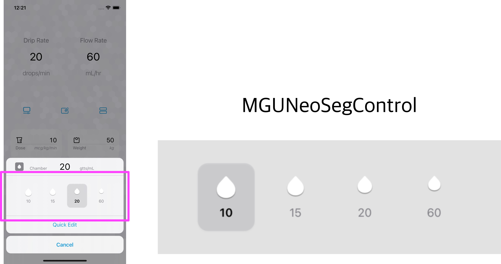

# MGUNeoSegControl 


<br/>


## **MGUNeoSegControl**
- `MGUNeoSegControl`는 `UISegmentedControl` 보다 더 많은 기능과 디자인의 자유도를 보장하는 커스텀 SegmentedControl
    - `UIControl` 서브클래스로 제작함
- [IV-Drop](https://apps.apple.com/app/id1574452904)을 만들면서 SheetViewController에 위치할 커스텀 SegmentedControl에 대한 요구사항이 있어서 제작함.
<p align="center"></p>


## Features
*  커스텀 사이즈 가능(`UISwitch` 및 `NSSwitch`와 동일한 `intrinsicContentSize`도 가지고 있음)
*  ON, OFF 영역에 이미지 또는 텍스트 설정 가능
*  커스텀 Shape 가능
    * ON, OFF 각각의 상태에 대하여 보더, 백그라운드, 손잡이 색을 개별적으로 설정가능
*  커스텀 손잡이 가능
*  Haptic Feedback 제공 : 제스처로 토글 시 Haptic Feedback이 터치한 Device를 통해 전달된다.
    * `UIImpactFeedbackGenerator` 이용하여 구현함
*  제스처가 다 끝나지 않은 상태(손가락이 떨어지지 않은 상태)에서 ON, OFF를 오고가는 상태를 Notification 등록을 통해 감시 가능
    * iOS : `MGUSevenSwitchStateChangedNotification` 을 이용하여 감시 가능함
*  **Swift** and **Objective-C** compatability


## Examples
> - MGUNeoSegControl (iOS)
>   - [IV-Drop](https://apps.apple.com/app/id1574452904)을 만들면서 커스텀 스위치의 요구사항이 있어서 제작함.


MGUNeoSegControl (iOS) | MGUNeoSegControl (iOS) | [IV-Drop](https://apps.apple.com/app/id1574452904)에서 사용한 예
---|---|---
||


## Usage

> Swift
```swift

let config = MGUNeoSegConfiguration.forge()
containerView.backgroundColor = config.backgroundColor
let segmentedControl = MGUNeoSegControl.init(titles: self.dropTitleAndImageModels(),
                                       selecedtitle: "",
                                      configuration: config)
view.addSubview(segmentedControl)
segmentedControl.addTarget(self, action: #selector(valueChanged(_:)), for: .valueChanged)
segmentedControl.impactOff = false

```

> Objective-C
```objective-c

MGUNeoSegControl *segmentedControl =
[[MGUNeoSegControl alloc] initWithTitles:[self imageModels]
                            selecedtitle:@"chrome"
                           configuration:[MGUNeoSegConfiguration iOS7Configuration]];
[self.view addSubview:segmentedControl];
[segmentedControl addTarget:self action:@selector(valueChanged:) forControlEvents:UIControlEventValueChanged];

```

## Documentation

- Segment 배치를 위한 설계도


## Author

sonkoni(손관현), isomorphic111@gmail.com 

## License

This project is released under the MIT License. See [LICENSE](https://github.com/sonkoni/Collection-of-Toy-Projects/blob/main/LICENSE) for more information.
