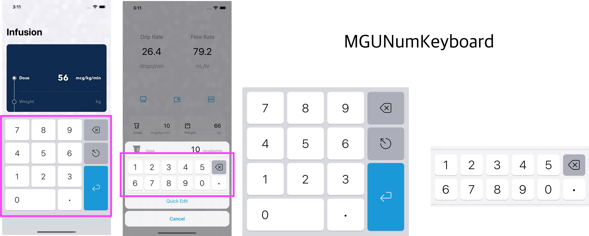
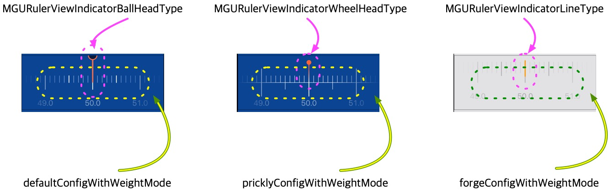

# MGUNumKeyboard 


<br/>


## **MGUNumKeyboard**
- 스크롤 제스처로 몸무게를 설정할 수 있는 RulerView
    - `UIScrollView` 를 기반으로 제작함
- [IV-Drop](https://apps.apple.com/app/id1574452904)을 만들면서 SheetViewController에 위치할 RulerView에 대한 요구사항이 있어서 제작함.
<p align="center"></p>


## Features
*  더블 탭, 트리플 탭 지원
    * 더블 탭, 트리플 탭 에 따라 이동할 길이 선택가능
*  Style presets 지원
    * 중앙 바늘의 모양에 대한 presets 지원
    * RulerView의 표시된 눈금의 위치와 길이에 대한 presets 지원
*  KG, LB 선택가능
*  Sound 지원
    * Driven Sound와 Scroll Sound의 소리 종류 및 간격을 각각 다르게 설정함
*  손가락이 접촉한 상태에는 스크롤의 저항을 표현하기 위해 Easing 함수를 이용함.
*  **Swift** and **Objective-C** compatability


## Examples
> - MGUNumKeyboard (iOS)
>   - [IV-Drop](https://apps.apple.com/app/id1574452904)을 만들면서 무게를 측정할 RulerView의 요구사항이 있어서 제작함.


Standard Style | Low Height Style | [IV-Drop](https://apps.apple.com/app/id1574452904)에서 사용 예 | [IV-Drop](https://apps.apple.com/app/id1574452904)에서 사용 예
---|---|---|---
|||

``|헤더2|헤더3|헤더4|헤더5|헤더6
---|---|---|---|---|---
Rounded|셀2|셀3|셀4|셀3|셀4
Rect   |셀6|셀7|셀8|셀3|셀4


## Usage

> Swift
```swift


```

> Objective-C
```objective-c


```

## Documentation

- RulerView의 바늘의 배치를 위한 설계도


- Style presets 지원


## Author

sonkoni(손관현), isomorphic111@gmail.com 

## License

This project is released under the MIT License. See [LICENSE](https://github.com/sonkoni/Collection-of-Toy-Projects/blob/main/LICENSE) for more information.
