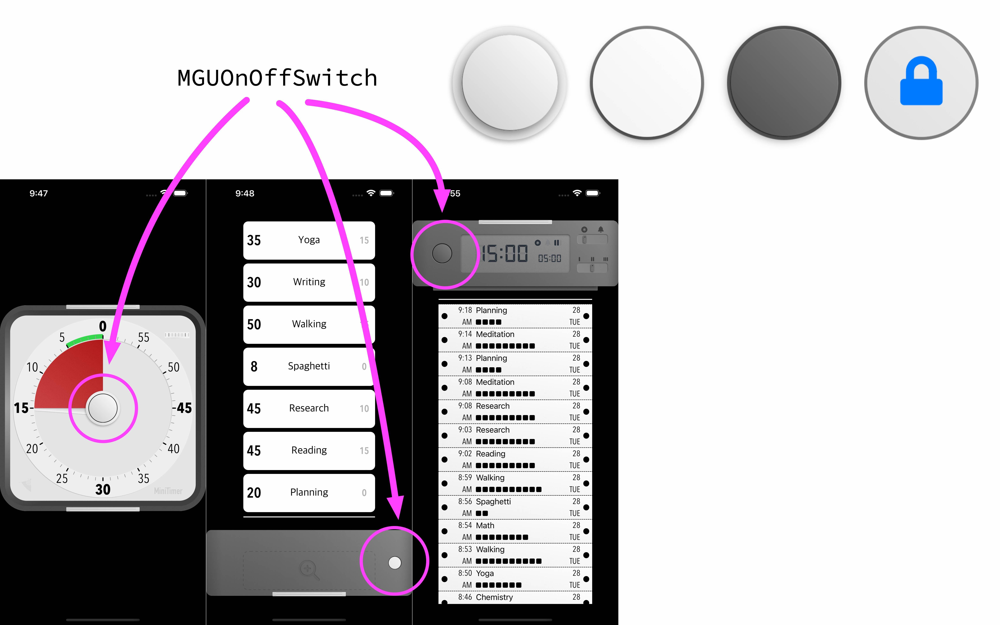

# MGUOnOffButton 


<br/>


## **MGUOnOffButton**
- Skeuomorphism(스큐어모피즘) 스타일의 애니메이팅 가능한 온오프 버튼
    - UIControl 서브클래스로 제작함
- [MiniTimer](https://apps.apple.com/app/id1618148240)을 만들면서 Skeuomorphism(스큐어모피즘) 스타일 온오프 버튼을 요구하여 제작함.
<p align="center"></p>


## Features
*  커스텀 Shape 및 애니메이션 가능
    * MGUOnOffSkinInterface 프로토콜을 따르는 뷰 객체를 제공하여 ON, OFF 상태에 따른 Shape과 애니메이션을 커스텀 가능
    * 입체적인 효과를 위해 OFF 상태에서의 터치다운과 ON 상태에서의 터치다운을 다른 Shape으로 제공가능 
*  Touch Area를 버튼 크기의 2배까지 설정가능
*  Haptic Feedback 제공 : 제스처로 토글 시 Haptic Feedback이 터치한 Device를 통해 전달된다.
    * `UIImpactFeedbackGenerator` 이용하여 구현함
*  **Swift** and **Objective-C** compatability
*  Written in Objective-C

## Preview
> - [MiniTimer](https://apps.apple.com/app/id1618148240)을 만들면서 커스텀 스위치의 요구사항이 있어서 제작함.  


MGUOnOffButton (iOS) |
---|
|


## Usage

> Swift
```swift

private var button = MGUOnOffButton(frame: .zero, skinView: MMTMidButtonSkin())

```

> Objective-C
```objective-c

_button = [[MGUOnOffButton alloc] initWithFrame:CGRectZero skinView:[MMTMidButtonSkin new]];

```

## Author

sonkoni(손관현), isomorphic111@gmail.com 

## License

This project is released under the MIT License. See [LICENSE](https://github.com/sonkoni/Collection-of-Toy-Projects/blob/main/LICENSE) for more information.
