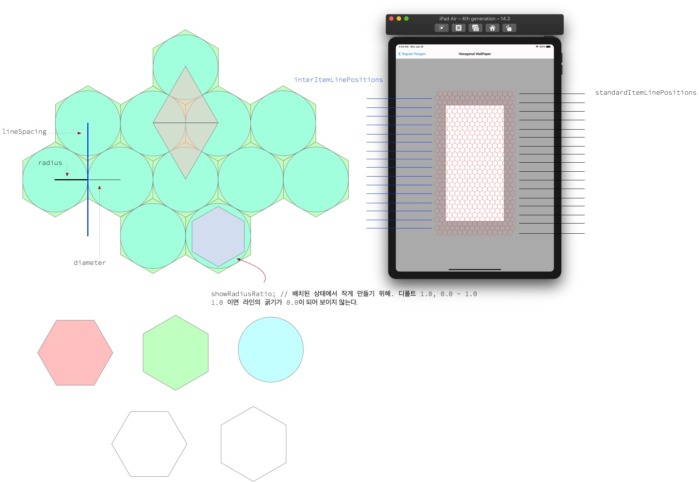

# HexagonalWallpaper 


<br/>


## 애니메이팅 가능한 Hexagonal Tiling Wallpaper View
- 앱의 배경을 꾸며줄 수 있는 애니메이팅 가능한 6각형 조각으로 빈틈없이 채우는(hexagonal tiling) Wallpaper View
- [IV-Drop](https://apps.apple.com/app/id1574452904)을 만들면서 Wallpaper의 요구사항이 있어서 제작함.

## Features
*  6각형 ***크기*** 조절 가능
*  6각형 ***보더 굵기*** 조절 가능
*  애니메이팅 + 리벌스 애니메이팅 가능
*  HSB 기반 랜덤 칼라(보더, 면) 가능
*  Support **SWIFT** and **OBJECTIVE-C**. 

## Examples
> - n각형 생성 및 회전
> - 크기 조절 및 커팅
> - 애니메이팅 + 리벌스 애니메이팅
> - [IV-Drop](https://apps.apple.com/app/id1574452904)에서 사용한 Wallpaper

n각형 생성 및 회전 | 크기 조절 및 커팅
---|---
|

애니메이팅 + 리벌스 애니메이팅 | [IV-Drop](https://apps.apple.com/app/id1574452904)에서 사용한 Wallpaper
---|---
|


## Documentation

- 도형 배치를 위한 알고리즘 구상



- 포커스 랜덤 함수 구상
    - 예를 들어 파란색 부터 흰색을 HSB 값으로 랜덤하게 배치했을 때, 파란색에 치우치게 랜덤 색이 나오게 하기 위해서 구상함


- [Read the full **documentation** here](http://wiki.mulgrim.net/page/Api:UIKit/UIView/-_layoutIfNeeded)

```swift

@objc private func switchToggled(_ sender: UISwitch) {
    sender.isEnabled = false
    centerYConstraint.isActive = false
    if sender.isOn == true {
        centerYConstraint = targetView.centerYAnchor.constraint(equalTo: view.centerYAnchor)
        widthConstraint.constant = 100.0
    } else {
        centerYConstraint = targetView.centerYAnchor.constraint(equalTo: view.safeAreaLayoutGuide.bottomAnchor, constant: -50.0)
        widthConstraint.constant = 50.0
    }
    centerYConstraint.isActive = true
        
    let animator = UIViewPropertyAnimator(duration: 1.0, dampingRatio: 0.4) {
        self.view.layoutIfNeeded() // 애니메이션 블락 안에서 layoutIfNeeded 메서드를 호출해야한다. 
    }
    animator.addCompletion { _ in
        sender.isEnabled = true
    }
    animator.startAnimation()
}

```

## Author

sonkoni(손관현), isomorphic111@gmail.com 

## License

This project is released under the MIT License.
