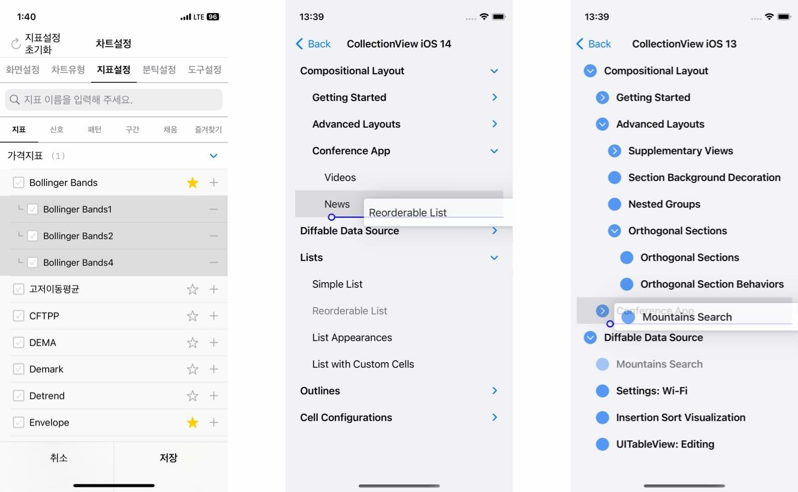
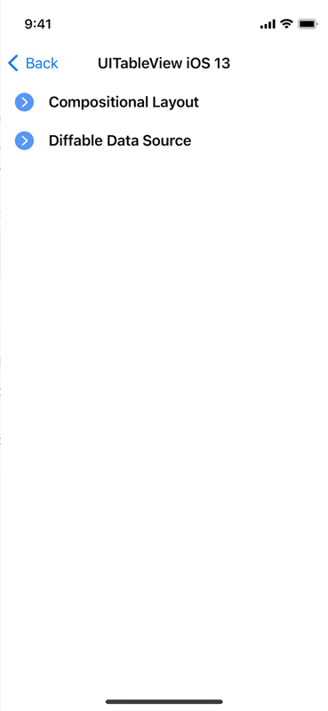
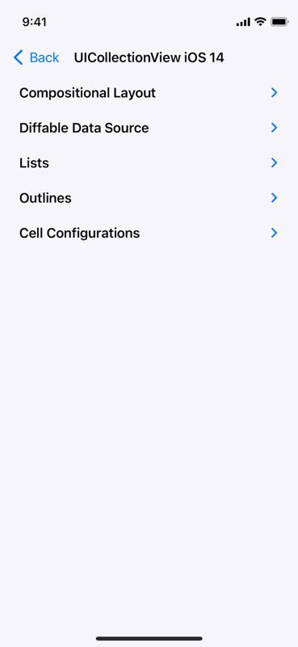
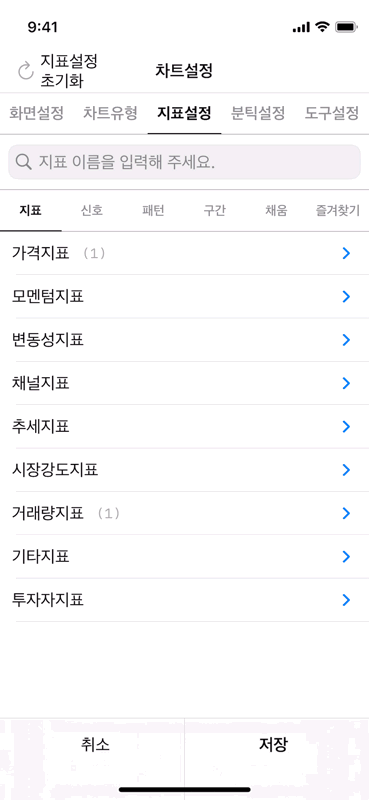
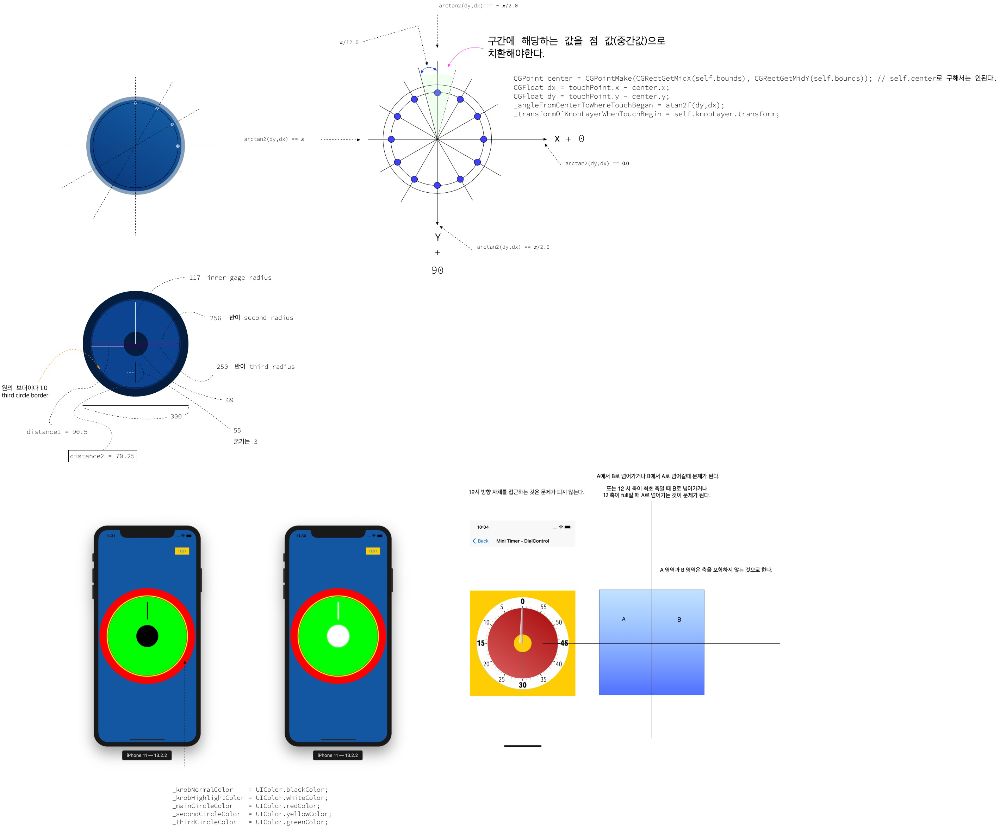

# Outline Project 


<br/>


## MGROutlineItem (***Objective-C***) <br/> SKHOutlineItem (***Swift***)
- 트리구조 라이브러리 & UI 구현(UI는 `UITableView` 또는 `UICollectionView` 이용)
- [MTS 프로젝트](https://youtu.be/161FoZYpU8I?si=z89zAGR5vfeHqILa&t=90)를 진행하면서 해당 트리구조 라이브러리 이용함.
> - MGROutlineItem
>   - 트리구조 라이브러리
>   - Written in **Objective-C**, **Swift** and **Objective-C** compatability
> - SKHOutlineItem
>   - 트리구조 라이브러리
>   - Written in **Swift**
<p align="center"></p>

## Features
*  휠의 회전으로 입력값을 설정 가능케 함
    * 손잡이 부분이 아니라도 휠 반경 전체에서 제스처 동작이 시작될 수 있음
*  제스처가 시작되고 중심으로부터 일정한 Radius를 벗어나면 제스처를 disable 시켜서 오작동을 방지함    
*  Sound 지원
    * 휠이 돌아가면서 값이 변화할 때마다 사용자에게 Feedback을 줄 수 있는 Sound 설정가능 
    * Sound Source는 Simulator에서 추출함     
*  **Swift** and **Objective-C** compatability
*  Written in Objective-C


## Preview
> - MGROutlineItem (***Objective-C***), SKHOutlineItem (***Swift***) & UI
>   - 트리구조 알고리즘과 이를 뷰모델로 이용하여 구현한 UI(`UITableView` OR `UICollectionView`)

Sample 1 | Sample 2 | [MTS 프로젝트](https://youtu.be/161FoZYpU8I?si=z89zAGR5vfeHqILa&t=90)에서 사용 예
---|---|---
||


## Usage

> Swift
```swift

sound = MGOSoundRuler.rulerSound
let dialControl = MMTDialControl()
dialControl.normalSoundPlayBlock = sound?.playSoundTickHaptic()
view.addSubview(dialControl)
dialControl.addTarget(self, action:#selector(dialValueChanged(_:)), for: .valueChanged)

```

> Objective-C
```objective-c

sound = [MGOSoundRuler rulerSound];
MMTDialControl *dialControl = [MMTDialControl new];
dialControl.normalSoundPlayBlock = [sound playSoundTickHaptic];
[self.view addSubview:dialControl];
[dialControl addTarget:self action:@selector(dialValueChanged:) forControlEvents:UIControlEventValueChanged];

```

## Documentation

- DialControl의 Behavior를 위한 설계도


## Author

sonkoni(손관현), isomorphic111@gmail.com 

## License

This project is released under the MIT License. See [LICENSE](https://github.com/sonkoni/Collection-of-Toy-Projects/blob/main/LICENSE) for more information.
