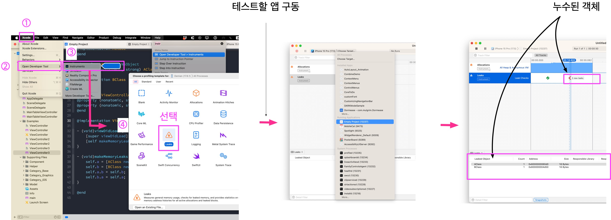

## Memory Leak의 대처 방법

Memory leak은 애플리케이션에서 할당된 메모리가 해제되지 않고 남아있어 시스템 자원을 낭비하는 현상이다. iOS 애플리케이션에서도 메모리 누수는 성능 저하와 크래시를 유발할 수 있기 때문에, 이를 방지하고 적절히 대처하는 것이 중요하다.

### 1. 메모리 누수의 원인

메모리 누수는 다음과 같은 원인으로 발생할 수 있다:
- **순환 참조**: 두 객체가 서로를 강하게 참조할 때 발생한다.
- **해제되지 않는 객체**: 더 이상 필요 없는 객체가 메모리에 남아 있을 때 발생한다.
- **클로저와 캡쳐 목록**: 클로저가 자신을 강하게 참조할 때 발생한다.

### 2. 메모리 누수 대처 방법

#### 2.1. **ARC(Automatic Reference Counting) 활용**

ARC는 Objective-C와 Swift에서 메모리 관리를 자동으로 처리해주는 시스템이다. ARC를 적절히 활용하여 메모리 관리를 수동으로 처리하는 것보다 오류를 줄일 수 있다.

#### 2.2. **순환 참조 해결**

순환 참조를 방지하기 위해 `weak`와 `unowned` 참조를 사용한다.

- **Weak 참조**: 객체가 메모리에서 해제될 때 자동으로 nil로 설정된다.
  
  ```objective-c
  @interface MyClass : NSObject
  @property (nonatomic, weak) MyOtherClass *otherClass;
  @end
  ```

- **Unowned 참조**: 객체가 해제되면 접근 시 크래시가 발생하지만, 강한 참조 사이클을 방지할 수 있다.
  
  ```swift
  class MyClass {
      var otherClass: MyOtherClass?
  }
  
  class MyOtherClass {
      weak var myClass: MyClass?
  }
  ```

#### 2.3. **클로저의 캡쳐 목록**

클로저가 자신을 캡쳐할 때 강한 참조를 방지하려면, 클로저의 캡쳐 목록에서 `weak` 또는 `unowned`를 사용한다.

```swift
let closure: () -> Void = { [weak self] in
    self?.doSomething()
}
```

#### 2.4. **객체 해제 및 디버깅**

- **`dealloc`**: Objective-C에서는 `dealloc` 메서드를 오버라이드하여 객체 해제 시 로그를 남길 수 있다.

  ```objective-c
  - (void)dealloc {
      NSLog(@"%@ is being deallocated", self);
      // ARC 메모리를 관리하므로 release메서드 호출이나, [super dealloc];을 해서는 안된다.
  }
  ```

- **Xcode Instruments**: Instruments의 Leaks 도구를 사용하여 메모리 누수를 분석하고, 누수가 발생하는 지점을 찾을 수 있다. 아래 이미지는 Instruments의 Leaks 도구 화면 예시이다.

<p align="center"></p>

#### 2.5. **메모리 관리 도구 사용**

- **Xcode Memory Graph Debugger**: 메모리 그래프 디버거를 통해 객체 간의 강한 참조 관계를 시각적으로 확인할 수 있다.

  

### 3. 메모리 누수 예방

- **정기적인 코드 리뷰**: 메모리 누수를 방지하기 위해 팀원들과의 정기적인 코드 리뷰를 실시한다.
- **테스트와 검증**: 메모리 사용 패턴을 분석하고, 다양한 시나리오에서 테스트를 진행한다.
- **리소스 해제**: `viewDidDisappear` 또는 `dealloc`에서 리소스를 적절히 해제한다.

### 결론

메모리 누수는 애플리케이션의 안정성과 성능에 큰 영향을 미친다. ARC를 활용하고, 순환 참조를 방지하며, 클로저의 캡쳐 목록을 적절히 설정하는 것이 중요하다. 또한, Instruments와 Xcode Memory Graph Debugger를 사용하여 정기적으로 메모리 상태를 분석하고 관리하는 것이 필요하다.
