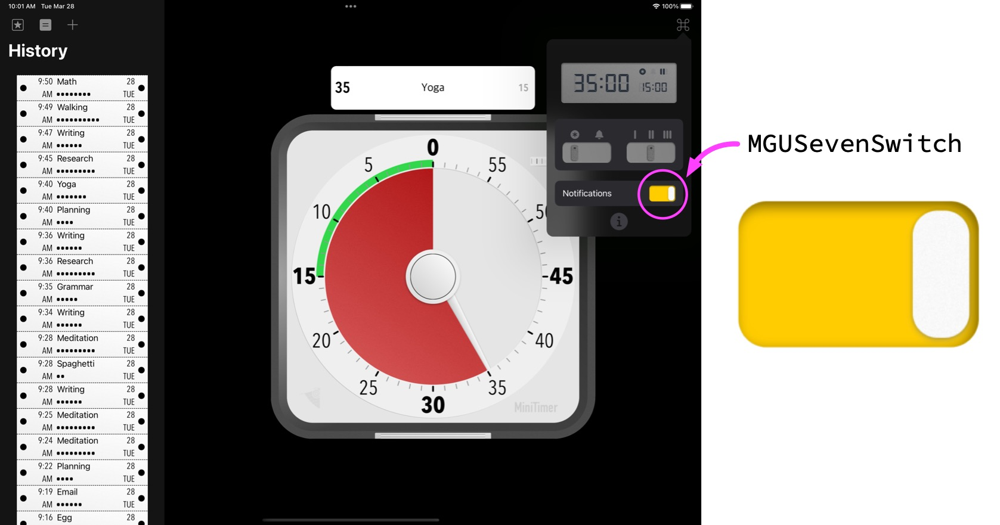
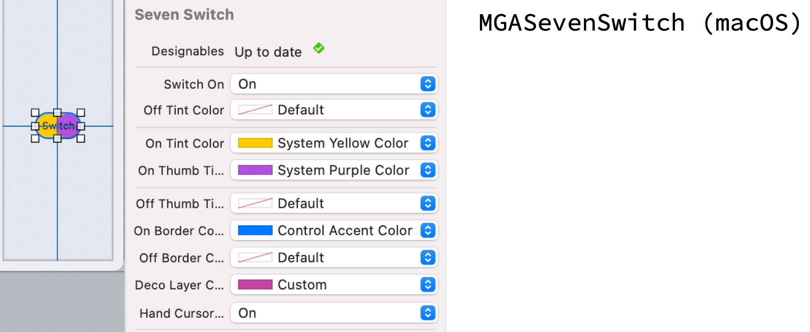
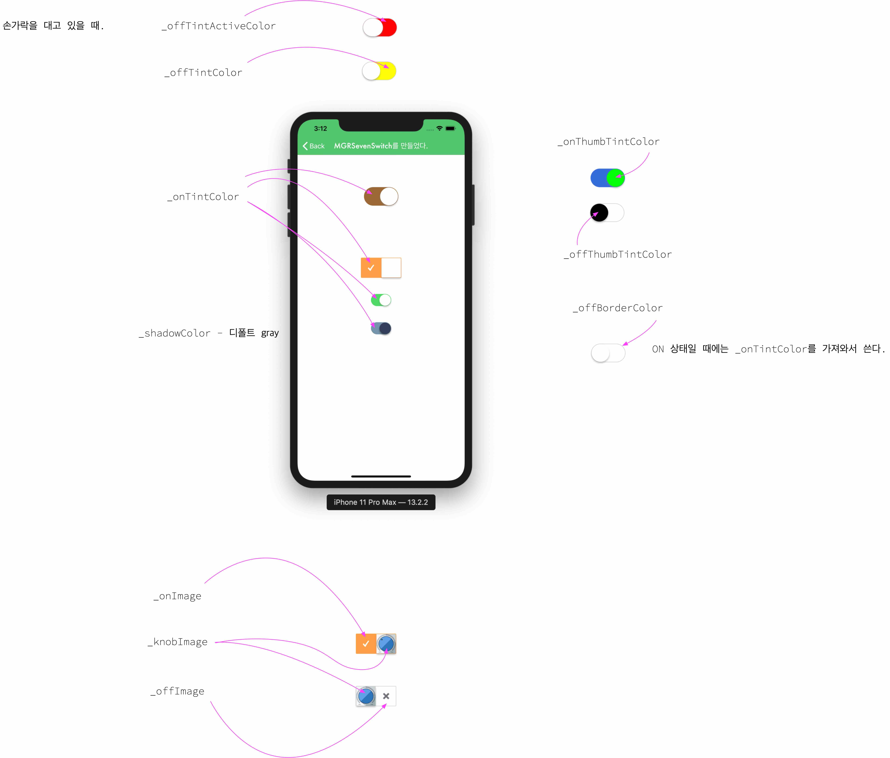

# SevenSwitch 


<br/>


## **MGUSevenSwitch** (***iOS***) <br/> **MGASevenSwitch** (***macOS***)
- `SevenSwitch`는 `UISwitch` 및 `NSSwitch` 보다 더 많은 기능과 디자인의 자유도를 보장하는 커스텀 스위치
    - MGUSevenSwitch : iOS 용 (UIControl 서브클래스)
    - MGASevenSwitch : macOS 용 (NSControl 서브클래스)
- [MiniTimer](https://apps.apple.com/app/id1618148240)을 만들면서 팝업에 위치할 커스텀 스위치의 요구사항이 있어서 제작함.
- 유사 프로젝트 : [DayNightSwitch](../DayNightSwitch)
<p align="center"></p>


## Features
*  커스텀 사이즈 가능(`UISwitch` 및 `NSSwitch`와 동일한 `intrinsicContentSize`도 가지고 있음)
*  ON, OFF 영역에 이미지 또는 텍스트 설정 가능
*  커스텀 Shape 가능
    * ON, OFF 각각의 상태에 대하여 보더, 백그라운드, 손잡이 색을 개별적으로 설정가능
*  커스텀 손잡이 가능
*  Haptic Feedback 제공 : 제스처로 토글 시 Haptic Feedback이 터치한 Device(아이폰, 트랙패드 등)를 통해 전달된다.
    * iOS : `UIImpactFeedbackGenerator` 이용하여 구현함
    * macOS : `NSHapticFeedbackManager` 이용하여 구현함
*  제스처가 다 끝나지 않은 상태(손가락이 떨어지지 않은 상태)에서 ON, OFF를 오고가는 상태를 Notification 등록을 통해 감시 가능
    * iOS : `MGUSevenSwitchStateChangedNotification` 을 이용하여 감시 가능함
    * macOS : `MGASevenSwitchStateChangedNotification` 을 이용하여 감시 가능함
*  MGASevenSwitch(macOS)는 마우스 hover 시에 커서 타입을 정할 수 있다.    
*  MGASevenSwitch(macOS)는 Interface Builder에서 설정가능하다. - 그러나 XCode 자체 렌더링 버그가 있기 때문에 추천하지 않는다.
    * Swift : `@IBDesignable` `@IBInspectable`
    * Objective-C : `IB_DESIGNABLE` `IBInspectable`
*  **Swift** and **Objective-C** compatability
*  Support **iOS**(***MGUSevenSwitch***) and **macOS**(***MGASevenSwitch***).
*  Written in Objective-C


## Preview
> - MGUSevenSwitch (iOS)
>   - [MiniTimer](https://apps.apple.com/app/id1618148240)을 만들면서 커스텀 스위치의 요구사항이 있어서 제작함.
> - MGASevenSwitch (macOS)


MGUSevenSwitch (iOS) | MGUSevenSwitch (iOS) | [MiniTimer](https://apps.apple.com/app/id1618148240)에서 사용한 예
---|---|---
||

MGASevenSwitch (macOS) |
---|
|


## Usage

> Swift
```swift

let sevenSwitch = MGUSevenSwitch(center: CGPoint.zero, switchOn: true, configuration: MGUSevenSwitchConfiguration.default())
view.addSubview(sevenSwitch)
sevenSwitch.addTarget(self, action: #selector(switchChanged(_:)), for: .valueChanged)

```

> Objective-C
```objective-c

_sevenSwitch =[[MGUSevenSwitch alloc] initWithCenter:CGPointZero
                                            switchOn:YES
                                       configuration:[MGUSevenSwitchConfiguration yellowConfiguration]];
[self.view addSubview:self.sevenSwitch];
[self.sevenSwitch addTarget:self action:@selector(switchChanged:) forControlEvents:UIControlEventValueChanged];

```
> Interface Builder




## Documentation


## Author

sonkoni(손관현), isomorphic111@gmail.com 

## License

This project is released under the MIT License. See [LICENSE](https://github.com/sonkoni/Collection-of-Toy-Projects/blob/main/LICENSE) for more information.
