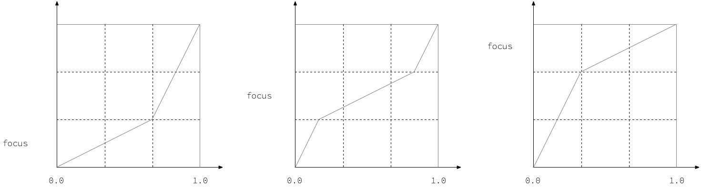

# SevenSwitch 


<br/>


## **MGUSevenSwitch**(***iOS***) & **MGASevenSwitch**(***macOS***)
- `UISwitch` 및 `NSSwitch` 보다 더 많은 기능과 디자인의 자유도를 보장하는 커스텀 스위치
    - MGUSevenSwitch : iOS 용 (UIControl 서브클래스)
    - MGASevenSwitch : macOS 용 (NSControl 서브클래스)
- [MiniTimer](https://apps.apple.com/app/id1618148240)을 만들면서 팝업에 위치할 커스텀 스위치의 요구사항이 있어서 제작함.
<p align="center"></p>


## Features
*  6각형 ***크기*** 조절 가능
*  6각형 ***보더 굵기*** 조절 가능
*  애니메이팅 + 리벌스 애니메이팅 가능
*  HSB 기반 랜덤 칼라(보더, 면) 가능
*  Haptic Feedback 제공 : 제스처로 토글 시 Haptic Feedback이 터치한 Device에서 전달된다.
    * iOS : UIImpactFeedbackGenerator 이용
    * macOS : NSHapticFeedbackManager 이용
*  **Swift** and **Objective-C** compatability
*  Support **iOS**(***MGUSevenSwitch***) and **macOS**(***MGASevenSwitch***).


## Examples
> - MGUSevenSwitch (iOS)
>   - [MiniTimer](https://apps.apple.com/app/id1618148240)을 만들면서 커스텀 스위치의 요구사항이 있어서 제작함.
> - MGASevenSwitch (macOS)


MGUSevenSwitch (iOS) | MGUSevenSwitch (iOS) | [MiniTimer](https://apps.apple.com/app/id1618148240)에서 사용한 예
---|---|---
||

MGASevenSwitch (macOS) |
---|
|


## Usage

## Documentation

- 도형 배치를 위한 알고리즘 구상


- 포커스 랜덤 함수 구상
    - 예를 들어 파란색 부터 흰색을 HSB 값으로 랜덤하게 배치했을 때, 파란색에 치우치게 랜덤 색이 나오게 하기 위해서 구상함



- `layer` 의 `timeOffset` 프라퍼티를 이용하여, 슬라이더로 애니메이팅을 수동 조절할 수 있음
    - [**timeOffset**](http://wiki.mulgrim.net/page/Api:Core_Animation/protocol_CAMediaTiming/timeOffset) <- 기술 위키 문서
    - [**Pausing and Resuming Animations**](https://developer.apple.com/library/archive/documentation/Cocoa/Conceptual/CoreAnimation_guide/AdvancedAnimationTricks/AdvancedAnimationTricks.html#//apple_ref/doc/uid/TP40004514-CH8-SW15)
```swift

@IBAction func sliderValueChanged(_ sender: UISlider) {
    hexagonalWallpaperView.layer.timeOffset = CFTimeInterval(sender.value)
}
private func onboardingAnimationStart() {
    let hexagonalProgressAnimation = self.hexagonalWallpaperView.hexagonalProgressAnimation()
    
    CATransaction.setCompletionBlock { }
    self.hexagonalWallpaperView.layer.add(hexagonalProgressAnimation, forKey: "HexagonalProgressAnimationKey")
}

```

## Author

sonkoni(손관현), isomorphic111@gmail.com 

## License

This project is released under the MIT License.
