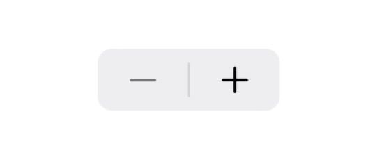

# Stepper 


<br/>


## iOS
> - MGUStepper
>   - Written in Objective-C
>   - **Swift** and **Objective-C** compatability
> - SKUStepper
>   - Written in Swift
## macOS
> MGAStepper
>   - Written in Objective-C
>   - **Swift** and **Objective-C** compatability

## **MGUStepper** (***iOS***), **SKUStepper** (***iOS***)-스위프트 전용 <br/> **MGAStepper** (***macOS***)
- `MGUStepper`, `MGAStepper`는 `UIStepper` 및 `NSStepper` 보다 더 많은 기능과 디자인의 자유도를 보장하는 커스텀 Stepper
    - MGUStepper : iOS 용 (UIControl 서브클래스)
    - MGAStepper : macOS 용 (NSControl 서브클래스)
- [IV-Drop](https://apps.apple.com/app/id1574452904)을 만들면서 팝업에 위치할 커스텀 Stepper에 대한 요구사항이 있어서 제작함.
<p align="center"></p>


## Features
*  커스텀 사이즈 가능(`intrinsicContentSize`도 가지고 있으므로 autolayout으로 position만으로도 설정 가능)
*  Label 설정가능
    * 가운데 Label을 표기할지에 대하여 설정할 수 있다.
    * 가운데 Label에 Drag 기능을 설정할 수 있다.
    * 가운데 Label에 현재 Stepper의 값을 표기할 수도 있고, 원하는 문구를 넣을 수도 있다.
*  Style presets 지원
    * 5가지의 presets 
    * presets에 추가적 커스텀 가능 
*  커스텀 Shape 가능
    * VisualEffectView를 배경으로 설정할 수 있다.
    * 버튼 및 중앙 Label에 image 또는 text를 설정할 수 있다.
    * Stepper, 버튼, 중앙 Label에 원하는 radius를 줄 수 있다.    
*  long press 지원
    * `UIStepper`처럼 long press 시 반복되어 버튼 press가 호출되고 일정 시간이 지나면 반복되는 간격이 빨라진다. 
*  Interface Builder에서 설정가능하다. - 그러나 XCode 자체 렌더링 버그가 있기 때문에 추천하지 않는다.
    * Swift : `@IBDesignable` `@IBInspectable`
    * Objective-C : `IB_DESIGNABLE` `IBInspectable`
*  **Swift** and **Objective-C** compatability
*  Support **iOS**(***MGUStepper***) and **macOS**(***MGAStepper***).
*  Written in Objective-C


## Preview
> - MGUStepper (iOS)
>   - [IV-Drop](https://apps.apple.com/app/id1574452904)을 만들면서 커스텀 Stepper에 대한 요구사항이 있어서 제작함.
> - MGAStepper (macOS)


MGUStepper (iOS) - xib | MGUStepper (iOS) - code | more custom | [IV-Drop](https://apps.apple.com/app/id1574452904)에서 사용한 예
---|---|---|---
|||

MGAStepper (macOS) |
---|
|


## Presets and Styles
> Built-in configuration

Default|iOS7 Style|iOS13 Style|IV-Drop1|IV-Drop2
---|---|---|---|---
 ||||

---

> More configuration<br/>
> 다음과 같이 직접적으로 프라퍼티를 조절하여 다양한 외관을 생성할 수 있다.

더 커스텀하기|
---|
|

## Usage

> Swift
```swift

stepper = MGUStepper(configuration: MGUStepperConfiguration.forgeDrop())
if let stepper = stepper {
    containerView.addSubview(stepper) // intrinsicContentSize 설정됨
    stepper.addTarget(self, action:#selector(stepperValueChanged(_:)), for: .valueChanged)
}

```

> Objective-C
```objective-c

_stepper = [[MGUStepper alloc] initWithConfiguration:[MGUStepperConfiguration forgeDropConfiguration]];
[self.view addSubview:self.stepper]; // intrinsicContentSize 설정됨
[self.stepper addTarget:self action:@selector(stepperValueChanged:) forControlEvents:UIControlEventValueChanged];

```
> Interface Builder


## Documentation

- long press 시 일정한 간격으로 반복 호출되며 반복호출되는 간격이 일정 시간이 지나면 빨라지게 하기위해 다음의 알고리즘을 구상함.
    - 반복 호출되다가 일정 시간이 지나면 반복 호출 간격이 5배로 빨라지고 또 일정 시간이나면 거기서 2배가 빨라진다.
```objective-c

//! 애플의 UIStepper와 유사하게 작동하게 하기 위해 만든 알고리즘. 타이머가 가속도를 가지고 움직이는 것처럼 골라준다.
- (NSInteger)timerFireCountModulo {
    if (self.timerFireCount > 80) { // 0.05(81) -> 0.05(82) -> 0.05(83) -> 0.05(84) -> 0.05(85)
        return 1; // 0.05 sec * 1 = 0.05 sec : (리턴값 * 0.05)는 호출되는 간격
    } else if (self.timerFireCount > 50) { // 0.1(52) -> 0.1(54) -> 0.1(56) -> 0.1(58) -> 0.1(60)
        return 2; // 0.05 sec * 2 = 0.1 sec : (리턴값 * 0.05)는 호출되는 간격
    } else { // 0.5(10) -> 0.5(20) -> 0.5(30) -> 0.5(40) -> 0.5(50)
        return 10; // 0.05 sec * 10 = 0.5 sec : (리턴값 * 0.05)는 호출되는 간격
    }
    //
    // self.timerFireCount % [self timerFireCountModulo] == 0 에 대한 호출.
    // 1. 0.5초마다 호출된다.(2.5초 동안 = 50 * 0.05) 즉, 5회 호출된다.
    // 2. 0.1초마다 호출된다.(1.5초 동안 = 30 * 0.05) 즉, 15회 호출된다.
    // 3. 0.05초마다 호출된다. 계속.
}

```

## Author

sonkoni(손관현), isomorphic111@gmail.com 

## License

This project is released under the MIT License. See [LICENSE](https://github.com/sonkoni/Collection-of-Toy-Projects/blob/main/LICENSE) for more information.
