# SwipeCell 


<br/>


## **MGUSwipeTableViewCell(***UITableView***)** & **MGUSwipeCollectionViewCell(***UICollectionView***)**
- 커스텀 CollectionView 에서 스와이프 기능을 지원하고 UITableView에서도 더 더양한 외관과 기능을 제공하는 스와이프 가능한 cell  
    - `UITableViewCell`, `UICollectionViewCell` 을 서브클래싱하여 제작함
- [MiniTimer](https://apps.apple.com/app/id1618148240)를 만들면서 커스텀 CollectionView에서 스와이프 기능을 요청하여 제작함.
<p align="center">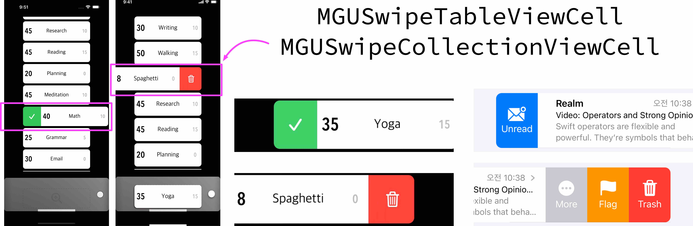</p>

 
## Features
*  Leading 및 Trailing swipe actions 지원
    * 아랍어와 같은 RTL(right to left) 방향의 문자 시스템에서는 leading이 오른쪽에서 대응하게 설계됨
*  Action button에 대하여 다양한 Display Mode와 Styles을 지원함
    * Button Display Mode: Image+Title, Image Only, Title Only 
    * Button Styles: Background Color, Circular 
*  다양한 Transition Styles 제공
    * Border Style 
    * Drag Style
    * Reveal Style
*  다양한 Transition Animation Type 제공
    * None 
    * Default
    * Favorite
    * Spring
    * Rotate
*  다양한 Expansion Styles 제공
    * None 
    * Selecton
    * Fill
    * Fill+Delete
    * FillReverse           
*  Diffable 기반 대응
*  Haptic Feedback 제공 : Expansion 발생 시 Haptic Feedback이 터치한 Device를 통해 전달된다.
    * `UIImpactFeedbackGenerator` 이용하여 구현함  
*  `UITableView`와 `UICollectionView` 모두 지원           
*  **Swift** and **Objective-C** compatability
*  Written in Objective-C


## Preview
> - MGUSwipeCollectionViewCell (UICollectionView)
>   - [MiniTimer](https://apps.apple.com/app/id1618148240)를 만들면서 커스텀 CollectionView에서 스와이프 기능을 요청하여 제작함.
> - MGUSwipeTableViewCell (UITableView)


MGUSwipeTableViewCell | MGUSwipeCollectionViewCell | [MiniTimer](https://apps.apple.com/app/id1618148240)(iPhone)에서 사용 예
---|---|---
||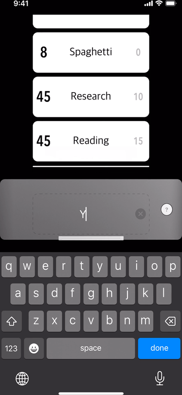

[MiniTimer](https://apps.apple.com/app/id1618148240)(iPad)에서 사용 예 |
---|
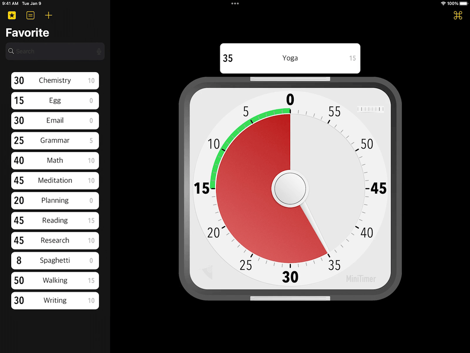 |


## Presets and Styles
> Transition Styles

Border Style|Drag Style|Reveal Style
---|---|---
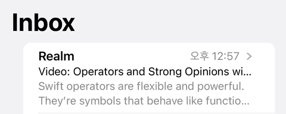|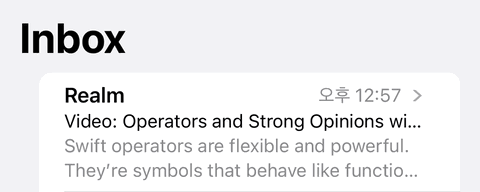|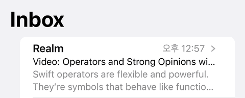

---
> Transition Animation Type

None|Default|Favorite|Spring|Rotate
---|---|---|---|---
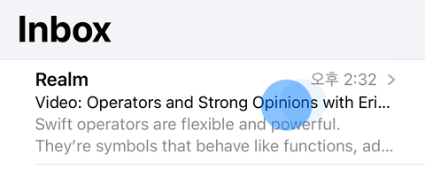|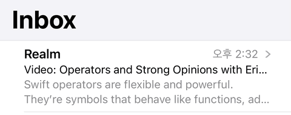|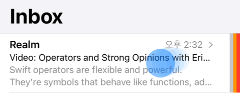||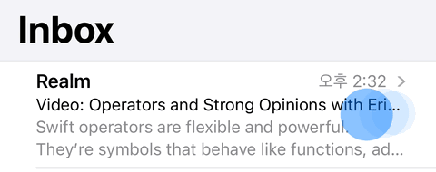

---
> Expansion Styles

None|Selecton|Fill|Fill+Delete|FillReverse
---|---|---|---|---
|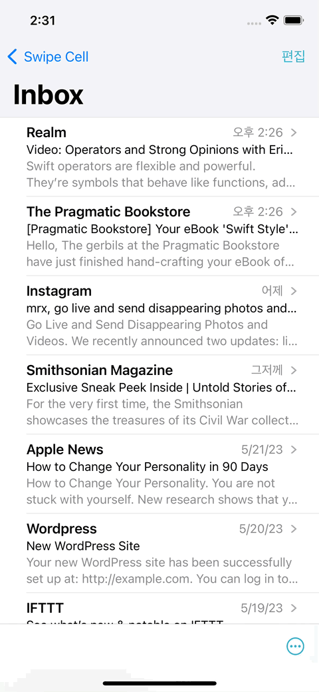|||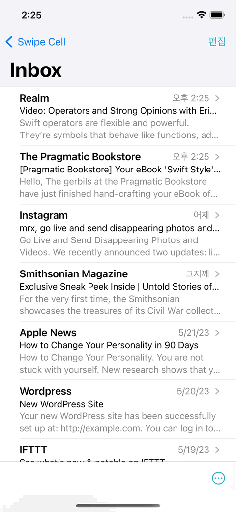

---
> Button Display Mode & Button Styles

&nbsp; &nbsp; &nbsp; Display Mode<br/>└───────┐<br/>Style &nbsp; &nbsp; &nbsp; &nbsp; &nbsp; &nbsp; &nbsp; &nbsp; &nbsp; &nbsp; &nbsp; &nbsp;|Image+Title|Image Only|Title Only
---|---|---|---
Background Color |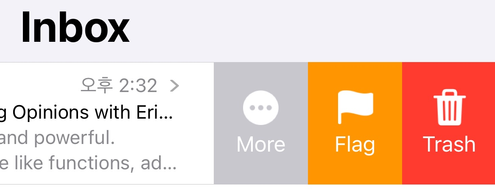|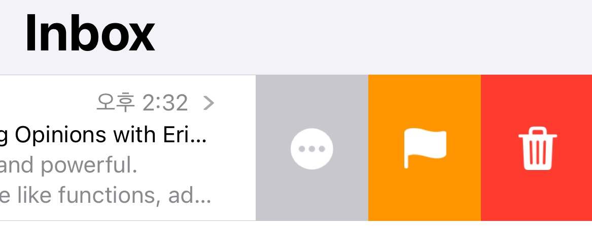|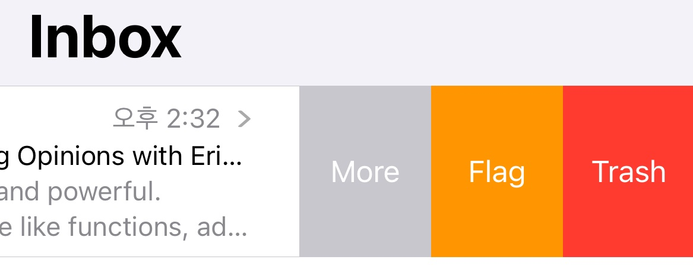
Circular   |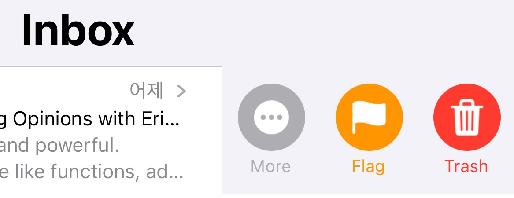|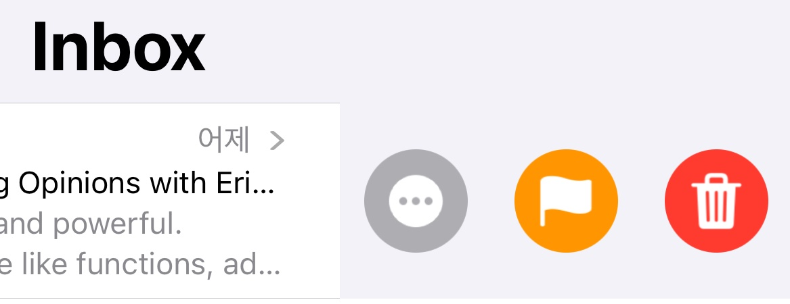|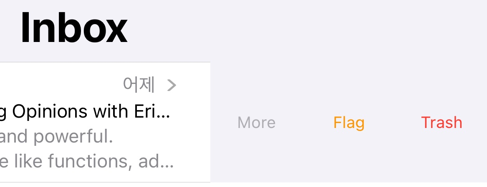


## Usage

<details> 
<summary>👇🖱️ Swift에서의 사용</summary>
<hr>

> * `MGUSwipeCollectionViewCell` 또는 `MGUSwipeTableViewCell`의 `delegate` 프라퍼티를 설정한다.
```swift
//! TableView
dataSource =
UITableViewDiffableDataSource (tableView: tableView) {
     (tableView: UITableView, indexPath: IndexPath, item: String) -> MGUSwipeTableViewCell? in
    guard let cell = tableView.dequeueReusableCell(
        withIdentifier:NSStringFromClass(MGUSwipeTableViewCell.self),
        for: indexPath) as? MGUSwipeTableViewCell else {
       return MGUSwipeTableViewCell()
    }
    var content = cell.defaultContentConfiguration()
    content.text = item
    cell.contentConfiguration = content
    cell.delegate = self // delegate 설정해야 swipe를 이용할 수 있다.
    return cell
}

//! CollectionView
dataSource = UICollectionViewDiffableDataSource(collectionView: collectionView,
                                                cellProvider: { (collectionView: UICollectionView,
                                                                 indexPath: IndexPath,
                                                                 cellModel: EmailCellModel) -> MGUSwipeCollectionViewCell? in
    guard let cell = collectionView.dequeueReusableCell(withReuseIdentifier: NSStringFromClass(CollectionViewEmailCell.self), for: indexPath) as? CollectionViewEmailCell else {
        return MGUSwipeCollectionViewCell()
     }
    cell.setData(cellModel)
    cell.delegate = self // delegate 설정해야 swipe를 이용할 수 있다.
    return cell
})

```

------

> * `MGUSwipeCollectionViewCellDelegate` 또는 `MGUSwipeTableViewCellDelegate`의 프로토콜을 구현한다.
>    * 필요에 따라서 옵셔널 메서드도 구현한다.
```swift
//! TableView
func tableView(_ tableView: UITableView, trailing_SwipeActionsConfigurationForRowAt indexPath: IndexPath) -> MGUSwipeActionsConfiguration? {
    let deleteAction = MGUSwipeAction.init(style: .destructive, title: nil) {[weak self] action, sourceView, completionHandler in
        if let items = [self?.items[indexPath.row]] as? [String],
           var snapshot = self?.dataSource?.snapshot() {
            snapshot.deleteItems(items)
            self?.items.remove(at: indexPath.row)
            self?.dataSource?.mgrSwipeApply(snapshot, tableView: tableView)
            //! 중요: MGUSwipeTableViewCell를 사용하여 스와이프로 삭제할 때는 내가 만든 메서드를 사용해야한다. ∵ 애니메이션 효과 때문에
        }
    }
    let image = UIImage.init(systemName: "trash")
    deleteAction.image = image?.mgrImage(with: .white)
    let configuration = MGUSwipeActionsConfiguration.init(actions: [deleteAction])
    configuration.expansionStyle = .fill()
    configuration.transitionStyle = .reveal
    configuration.backgroundColor = .systemRed
    return configuration
}

//! CollectionView
func collectionView(_ collectionView: UICollectionView, trailing_SwipeActionsConfigurationForItemAt indexPath: IndexPath) -> MGUSwipeActionsConfiguration? {
    let deleteAction = MGUSwipeAction.init(style: .destructive, title: nil) {[weak self] action, sourceView, completionHandler in
        if let items = [self?.emails[indexPath.row]] as? [EmailCellModel],
           var snapshot = self?.dataSource?.snapshot() {
            snapshot.deleteItems(items)
            self?.emails.remove(at: indexPath.row)
            self?.dataSource?.mgrSwipeApply(snapshot, collectionView: collectionView)
            //! 중요: MGUSwipeCollectionViewCell를 사용하여 스와이프로 삭제할 때는 내가 만든 메서드를 사용해야한다. ∵ 애니메이션 효과 때문에
        }
    }
    let image = UIImage.init(systemName: "trash")
    deleteAction.image = image?.mgrImage(with: .white)
    deleteAction.title = "Trash"
    let configuration = MGUSwipeActionsConfiguration.init(actions: [deleteAction])
    configuration.expansionStyle = .fill()
    configuration.transitionStyle = .reveal
    configuration.backgroundColor = .systemRed
    return configuration
}

```
</details>


<details> 
<summary>👇🖱️ Objective-C에서의 사용</summary>
<hr>

> *  `MGUSwipeCollectionViewCell` 또는 `MGUSwipeTableViewCell`의 `delegate` 프라퍼티를 설정한다.
```objective-c
//! TableView
_dataSource =
[[UITableViewDiffableDataSource alloc] initWithTableView:self.tableView
                                            cellProvider:^MGUSwipeTableViewCell *(UITableView *tableView, NSIndexPath *indexPath, NSString *item) {
    MGUSwipeTableViewCell *cell =
    [tableView dequeueReusableCellWithIdentifier:NSStringFromClass([MGUSwipeTableViewCell class])
                                    forIndexPath:indexPath];
    UIListContentConfiguration *content = [cell defaultContentConfiguration];
    content.text = item;
    cell.contentConfiguration = content;
    cell.delegate = self; // delegate 설정해야 swipe를 이용할 수 있다.
    return cell;
}];

//! CollectionView
self->_diffableDataSource =
[[UICollectionViewDiffableDataSource alloc] initWithCollectionView:self.collectionView
                                                      cellProvider:^UICollectionViewCell *(UICollectionView *collectionView, NSIndexPath *indexPath, EmailCellModel *cellModel) {
    CollectionViewEmailCell *cell = [collectionView dequeueReusableCellWithReuseIdentifier:NSStringFromClass([CollectionViewEmailCell class]) forIndexPath:indexPath];
    [cell setData:cellModel];
    cell.delegate = self; // delegate 설정해야 swipe를 이용할 수 있다.
    return cell;
}];

```

------
> * `MGUSwipeCollectionViewCellDelegate` 또는 `MGUSwipeTableViewCellDelegate`의 프로토콜을 구현한다.
>     * 필요에 따라서 옵셔널 메서드도 구현한다.
```objective-c
//! TableView
- (MGUSwipeActionsConfiguration *)tableView:(UITableView *)tableView
trailing_SwipeActionsConfigurationForRowAtIndexPath:(NSIndexPath *)indexPath {
    __weak __typeof(self) weakSelf = self;
    MGUSwipeAction *deleteAction =
    [MGUSwipeAction swipeActionWithStyle:MGUSwipeActionStyleDestructive
                                   title:nil
                                 handler:^(MGUSwipeAction * _Nonnull action,
                                           __kindof UIView * _Nonnull sourceView,
                                           void (^ _Nonnull completionHandler)(BOOL)) {
        NSDiffableDataSourceSnapshot <NSString *, NSString *>*snapshot = weakSelf.dataSource.snapshot;
        [snapshot deleteItemsWithIdentifiers:@[weakSelf.items[indexPath.row]]];
        [weakSelf.items removeObjectAtIndex:indexPath.row];
        [weakSelf.dataSource mgrSwipeApplySnapshot:snapshot tableView:tableView completion:nil];
        //! 중요: MGUSwipeTableViewCell를 사용하여 스와이프로 삭제할 때는 내가 만든 메서드를 사용해야한다. ∵ 애니메이션 효과 때문에
    }];
            
    UIImage *image = [UIImage systemImageNamed:@"trash"];
    deleteAction.image = [image mgrImageWithColor:[UIColor whiteColor]];
    MGUSwipeActionsConfiguration *configuration = [MGUSwipeActionsConfiguration configurationWithActions:@[deleteAction]];
    configuration.expansionStyle = [MGUSwipeExpansionStyle fill];
    configuration.transitionStyle = MGUSwipeTransitionStyleReveal;
    configuration.backgroundColor = [UIColor systemRedColor];
    return configuration;
}

//! CollectionView
- (MGUSwipeActionsConfiguration *)collectionView:(UICollectionView *)collectionView
trailing_SwipeActionsConfigurationForItemAtIndexPath:(NSIndexPath *)indexPath {
    CollectionViewEmailCell *cell = (CollectionViewEmailCell *)[collectionView cellForItemAtIndexPath:indexPath];
    __weak __typeof(self) weakSelf = self;
    MGUSwipeAction *deleteAction =
    [MGUSwipeAction swipeActionWithStyle:MGUSwipeActionStyleDestructive
                                   title:@"Trash"
                                 handler:^(MGUSwipeAction *action, UIView *sourceView, void (^completionHandler)(BOOL)) {
        NSDiffableDataSourceSnapshot <NSNumber *, EmailCellModel *>*snapshot = weakSelf.diffableDataSource.snapshot;
        [snapshot deleteItemsWithIdentifiers:@[weakSelf.emails[indexPath.row]]];
        [weakSelf.emails removeObjectAtIndex:indexPath.row];
        [weakSelf.diffableDataSource mgrSwipeApplySnapshot:snapshot collectionView:weakSelf.collectionView completion:nil];
        //! 중요: MGUSwipeCollectionViewCell를 사용하여 스와이프로 삭제할 때는 내가 만든 메서드를 사용해야한다. ∵ 애니메이션 효과 때문에
    }];
    UIImage *image = [UIImage systemImageNamed:@"trash"];
    deleteAction.image = [image mgrImageWithColor:[UIColor whiteColor]];
    MGUSwipeActionsConfiguration *configuration = [MGUSwipeActionsConfiguration configurationWithActions:@[deleteAction]];
    configuration.expansionStyle = [MGUSwipeExpansionStyle fill];
    configuration.transitionStyle = MGUSwipeTransitionStyleReveal;
    configuration.backgroundColor = [UIColor systemRedColor];
    return configuration;
}

```
</details>


## Documentation

<details> 
<summary>👇🖱️ Folding Style : Layout 알고리즘</summary>
<hr>

> <strong>Note:</strong> `UICollectionViewLayoutAttributes` 을 서브 클래싱하여 `position` 프라퍼티를 추가하고 이를 통해 offset에 따른 현재 cell이 기준선(접혀야하는 라인)에서의 거리를 디텍팅하고, 자신이 index가 짝수인지 홀수 인지에 따라서 `transform3D`를 적용하여 적절한 최종적인 layout을 결정하게한다.

```objective-c

- (void)applyTransformTo:(MGUFlowCellLayoutAttributes *)attributes {
    if (self.flowView == nil) {
        return;
    }
    MGUFlowLayout *collectionViewLayout = (MGUFlowLayout *)(self.flowView.collectionViewLayout);
    CGFloat itemSpacing = collectionViewLayout.itemSpacing;
    
    if (attributes.representedElementCategory == UICollectionElementCategoryCell) {
        if (attributes.position >= 1.0 ||
            (attributes.position >= 0.0 && attributes.indexPath.item % 2 == 0)) { // 기준선에 확 못 미치거나, 짝수 인덱스 (0, 2...) 일때에는 0.0
            attributes.alpha = 1.0;
            attributes.transform3D = CATransform3DIdentity;
            attributes.zIndex = 0;
        } else if (attributes.position <= - 2.0 ||
              (attributes.position <= - 1.0 && attributes.indexPath.item % 2 == 1) ) { // 아예 감춰라. 바때문이라도 이건 감춰야한다.
            attributes.alpha = 0.0;
            attributes.transform3D = CATransform3DIdentity;
            attributes.zIndex = 0;
            return;
        } else {
            CATransform3D transform3D = CATransform3DIdentity;
            transform3D.m34 = -1.0 / self.eyePosition;  // 음수로 커질 수록(작으질 수록) 더 많이 꺾인다.
            attributes.center = CGPointMake(attributes.center.x, attributes.center.y - attributes.position * itemSpacing);
            if (attributes.indexPath.item % 2 == 0) { // 짝수 인덱스. 0.0 <~< -2.0 까지 변한다. 윗 부분.
                // 면적으로 결정하는 것이 합당할 듯하다.
                CGFloat area = ((itemSpacing / 2.0) * attributes.position) + itemSpacing;
                CGFloat rotateRadian = -acos(area / itemSpacing);
                CGFloat yTranslate1 = itemSpacing/2.0 + (-cos(rotateRadian) *(itemSpacing / 2.0)); // 회전으로 인해 땡겨야하는 부분.
                CGFloat zTranslate = sin(rotateRadian) * (itemSpacing / 2.0);
                transform3D = CATransform3DTranslate(transform3D, 0.0, 0.0, zTranslate);
                transform3D = CATransform3DTranslate(transform3D, 0.0, -yTranslate1, 0.0);
                transform3D = CATransform3DRotate(transform3D, rotateRadian, 1.0, 0.0, 0.0);
                attributes.transform3D = transform3D;
            } else { // 홀수 인덱스. 1.0 <~< -1.0 까지 변한다. 아랫 부분.
                CGFloat area = ((itemSpacing / 2.0) * attributes.position) + itemSpacing / 2.0;
                CGFloat rotateRadian = acos(area / itemSpacing);
                CGFloat yTranslate1 = itemSpacing/2.0 - (cos(rotateRadian) *(itemSpacing / 2.0)); // 회전으로 인해 땡겨야하는 부분.
                CGFloat yTranslate = itemSpacing - (3.0 * yTranslate1);
                CGFloat zTranslate = -sin(rotateRadian) * (itemSpacing / 2.0);
                transform3D = CATransform3DTranslate(transform3D, 0.0, 0.0, zTranslate);
                transform3D = CATransform3DTranslate(transform3D, 0.0, yTranslate, 0.0);
                transform3D = CATransform3DRotate(transform3D, rotateRadian, 1.0, 0.0, 0.0);
                attributes.transform3D = transform3D;
            }
        }
    } else if (attributes.representedElementCategory == UICollectionElementCategorySupplementaryView) {
        if ([attributes.representedElementKind isEqualToString:MGUFlowElementKindFoldLeading]) {
            CGFloat margin = (itemSpacing + collectionViewLayout.actualLeadingSpacing) / 2.0;
            if (attributes.position >= 0.0) {
                attributes.alpha = 0.0;
            } else if (attributes.position <= -2.0) {
                attributes.alpha = 1.0;
            } else { // - 2 < < 0.0 => 알파1.0 ~ 알파0.0
                attributes.alpha = -attributes.position / 2.0;
            }
            attributes.center = CGPointMake(attributes.center.x, attributes.center.y - (attributes.position * itemSpacing) - margin);
            attributes.zIndex = 1000;
        }
    }
    return;
}

```

</details>


<details> 
<summary>👇🖱️ Vega Style : Layout 알고리즘</summary>
<hr>

> <strong>Note:</strong> `UICollectionViewLayoutAttributes` 을 서브 클래싱하여 `position` 프라퍼티를 추가하고 이를 통해 offset에 따른 현재 cell이 기준선(밑으로 잠기는 라인)에서의 거리를 디텍팅하여 `transform3D`, `alpha`를 적용하여 적절한 최종적인 layout을 결정하게한다.

```objective-c

- (void)applyTransformTo:(MGUFlowCellLayoutAttributes *)attributes {
    if (self.flowView == nil) {
        return;
    }
    
    MGUFlowLayout *collectionViewLayout = (MGUFlowLayout *)(self.flowView.collectionViewLayout);
    CGFloat itemSpacing = collectionViewLayout.itemSpacing;
    if (attributes.representedElementCategory == UICollectionElementCategoryCell) {
        if (attributes.position >= 0.0) {
            attributes.alpha = 1.0;
            attributes.transform3D = CATransform3DIdentity;
            attributes.zIndex = 0;
        } else {
            CGFloat yTranslate = (self.flowView.reversed == YES) ? attributes.position * itemSpacing : -attributes.position * itemSpacing;
            CGFloat scaleFactor = (attributes.position / 10.0) + 1.0; // 분모를 작게 하면 확 줄어든다.
            scaleFactor = MIN(1.0, MAX(0.0, scaleFactor));
            CGFloat alphaFactor = (attributes.position / 5.0) + 1.0;
            alphaFactor = MIN(1.0, MAX(0.0, alphaFactor));
            CATransform3D transform = CATransform3DTranslate(CATransform3DIdentity, 0.0, yTranslate, 0.0);
            transform = CATransform3DScale(transform, scaleFactor, scaleFactor, 1.0);
            attributes.transform3D = transform;
            attributes.zIndex = (NSInteger)(floor(attributes.position) - 1.0);
            attributes.alpha = alphaFactor;
        }
    } else if (attributes.representedElementCategory == UICollectionElementCategorySupplementaryView) {
        if ([attributes.representedElementKind isEqualToString:MGUFlowElementKindVegaLeading]) {
            CGFloat margin = (itemSpacing - self.proposedInteritemSpacing + collectionViewLayout.actualLeadingSpacing) / 2.0;
            margin = margin + (attributes.position * itemSpacing);
            if (self.flowView.reversed == YES) {
                margin = margin * -1.0;
            }
            
            if (attributes.position >= 0.0) {
                attributes.alpha = 0.0;
            } else if (attributes.position <= -1.0) {
                attributes.alpha = 1.0;
            } else { // - 1 < < 0.0 => 알파1.0 ~ 알파0.0
                attributes.alpha = ABS(attributes.position);
            }
            attributes.center = CGPointMake(attributes.center.x, attributes.center.y - margin);
            attributes.zIndex = 1000;
        }
    }
    return;
}

```

</details>


<details> 
<summary>👇🖱️ 역순으로 정렬되는 Layout을 확보하기 위한 아이디어</summary>
<hr>

> <strong>Note:</strong> `UICollectionViewLayout` 을 서브 클래싱하여 `prepareLayout`  메서드를 재정의하여 컨텐츠가 최소한 콜렉션뷰 프레임보다는 같거나 크게 해야 역순으로 넣을 수 있는 공간이 확보된다.

```objective-c

- (void)prepareLayout {
    if (self.collectionView == nil || self.flowView == nil) {
        return;
    }
    if (self.needsReprepare == NO && CGSizeEqualToSize(self.collectionViewSize, self.collectionView.frame.size)) {
        return;
    }
    
    self.needsReprepare = NO;
    self.collectionViewSize = self.collectionView.frame.size;
    MGUFlowDiffableDataSource *dataSource = self.collectionView.dataSource;
    NSDiffableDataSourceSnapshot *snapshot = (dataSource.tempSnapshot != nil)? dataSource.tempSnapshot : [dataSource snapshot];
    self.numberOfSections = snapshot.numberOfSections;
    self.numberOfItems = (self.numberOfSections == 0) ? 0 : (snapshot.numberOfItems / snapshot.numberOfSections);
    
    CGSize size = self.flowView.itemSize;
    if (CGSizeEqualToSize(size, CGSizeZero)) {
        self.actualItemSize = self.collectionView.frame.size;
    } else {
        self.actualItemSize = size;
    }

    if (self.flowView.transformer != nil) {
        self.actualInteritemSpacing = [self.flowView.transformer proposedInteritemSpacing];
    } else {
        self.actualInteritemSpacing = self.flowView.interitemSpacing;
    }
    
    self.scrollDirection = self.flowView.scrollDirection;
    self.actualLeadingSpacing  = self.flowView.leadingSpacing;
    self.reversed = self.flowView.reversed;
    
    self.itemSpacing = (self.scrollDirection == UICollectionViewScrollDirectionHorizontal ? self.actualItemSize.width : self.actualItemSize.height) + self.actualInteritemSpacing;

    // contentSize 계산 및 캐시하여, 매번 계산하지 않게한다.
    NSInteger numberOfItems = self.numberOfItems * self.numberOfSections;
    if (self.scrollDirection == UICollectionViewScrollDirectionHorizontal) {
        CGFloat contentSizeWidth = self.actualLeadingSpacing * 2.0; // Leading & trailing spacing
        contentSizeWidth += (numberOfItems - 1) * self.actualInteritemSpacing; // Interitem spacing
        contentSizeWidth += numberOfItems * self.actualItemSize.width; // Item sizes
        //! reverse를 위해서 최소한 collectionView 의 크기만큼은 확보한다.
        contentSizeWidth = MAX(contentSizeWidth, self.collectionView.frame.size.width);
        self.contentSize = CGSizeMake(contentSizeWidth, self.collectionView.frame.size.height);
        
        //! paging을 위해서는 추가적인 size가 필요할 가능성이 높다.
        if (contentSizeWidth != self.collectionView.frame.size.width) {
            CGFloat maxOffset = contentSizeWidth - self.collectionView.frame.size.width;
            CGFloat itemSpacing = self.itemSpacing;
            if ([self.flowView.transformer isKindOfClass:[MGUFlowFoldTransformer class]] == YES) {
                itemSpacing = itemSpacing * 2.0; // 두 칸씩 멈춘다.
            }
            CGFloat remainder = fmod(maxOffset, itemSpacing);
            if (remainder > FLT_EPSILON) { // 보정하라.
                CGFloat additionalMargin = itemSpacing - remainder;
                self.contentSize = CGSizeMake(self.contentSize.width + additionalMargin, self.contentSize.height);
            }
        }
    } else {
        CGFloat contentSizeHeight = self.actualLeadingSpacing * 2; // Leading & trailing spacing
        contentSizeHeight += (numberOfItems - 1) * self.actualInteritemSpacing; // Interitem spacing
        contentSizeHeight += numberOfItems * self.actualItemSize.height; // Item sizes
        contentSizeHeight = MAX(contentSizeHeight, self.collectionView.frame.size.height);
        self.contentSize = CGSizeMake(self.collectionView.frame.size.width, contentSizeHeight);
        
        //! paging을 위해서는 추가적인 size가 필요할 가능성이 높다.
        if (contentSizeHeight != self.collectionView.frame.size.height) {
            CGFloat maxOffset = contentSizeHeight - self.collectionView.frame.size.height;
            CGFloat itemSpacing = self.itemSpacing;
            if ([self.flowView.transformer isKindOfClass:[MGUFlowFoldTransformer class]] == YES) {
                itemSpacing = itemSpacing * 2.0; // 두 칸씩 멈춘다.
            }
            CGFloat remainder = fmod(maxOffset, itemSpacing);
            if (remainder > FLT_EPSILON) { // 보정하라.
                CGFloat additionalMargin = itemSpacing - remainder;
                self.contentSize = CGSizeMake(self.contentSize.width, self.contentSize.height + additionalMargin);
            }
        }
    }
    
    [self adjustCollectionViewBounds];
}

```

</details>


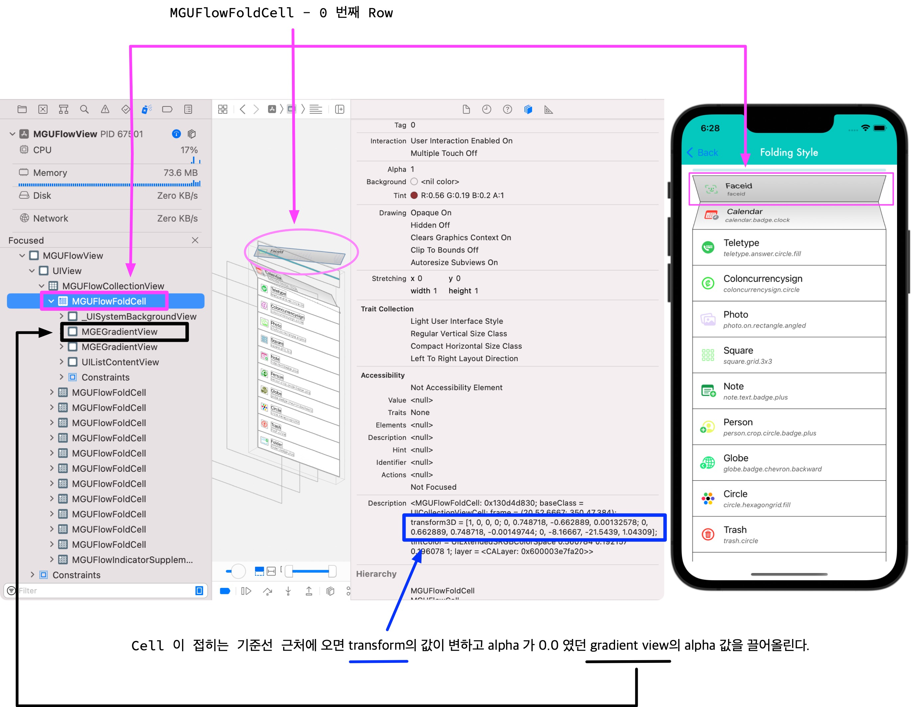
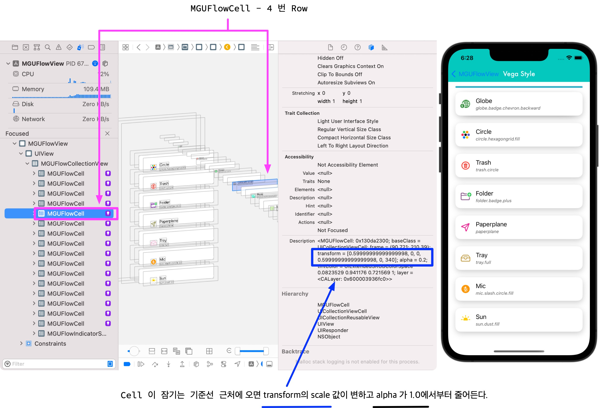

## Author

sonkoni(손관현), isomorphic111@gmail.com


## Credits

Inspired by [SwipeCellKit](https://github.com/SwipeCellKit/SwipeCellKit) by [Mohammad Kurabi](https://github.com/kurabi).

### Differences and Improvements 
$~$|[SwipeCellKit](https://github.com/SwipeCellKit/SwipeCellKit) by [Mohammad Kurabi](https://github.com/kurabi)|MGUSwipeTableViewCell / MGUSwipeCollectionViewCell
---|---|---
CollectionView|셀2|셀3
셀5|셀6|셀7


## License

This project is released under the MIT License. See [LICENSE](https://github.com/sonkoni/Collection-of-Toy-Projects/blob/main/LICENSE) for more information.
