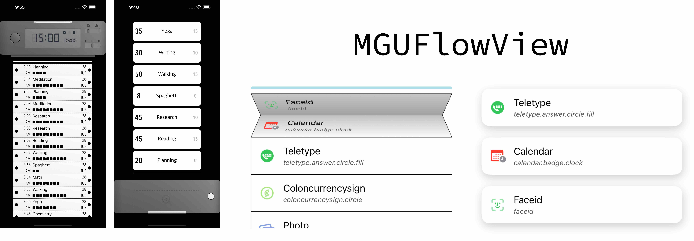
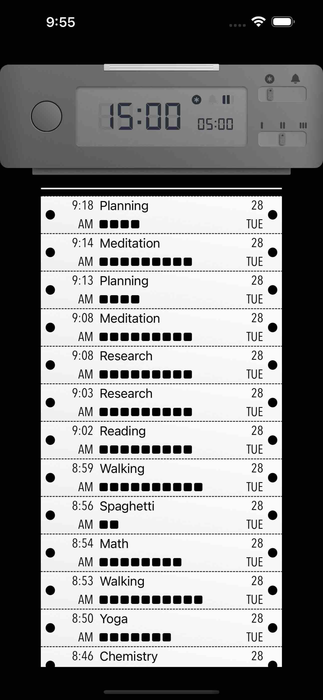
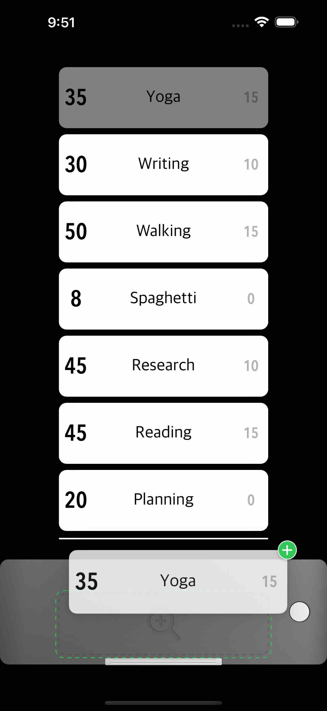

# SwipeCell 


<br/>


## **MGUFlowView**
- 스크롤 시 접히는 종이처럼 접히는 Layout과 역순(아래에서 부터) 정렬 가능하며 말단에서 말려들어가는 Layout을 지원하는 Table View를 대체할 수 있는 Component  
    - `UICollectionViewLayout`, `UICollectionViewLayoutAttributes` 를 서브클래싱하여 제작함
- [MiniTimer](https://apps.apple.com/app/id1618148240)를 만들면서 종이처럼 접히는 레이아웃의 테이블 뷰 및 역순으로 정렬되는 테이블뷰를 요청하여 제작함.
<p align="center"></p>

 
## Features
*  독특한 레이아웃 지원
    * Folding Style: 스크롤 시 종이처럼 접히는 레이아웃 
    * Vega Style: 스크롤 시 끝단에서 말리는 레이아웃 제공
        * reverse order 기능 존재함. 아이템이 아래에서부터 차오른다. - [Preview](#preview) 참고.
*  인디케이터 제공
    * 스크롤이 되어 접힌 셀이 존재할 때, 유저에게 인지 시키기 위해 인디케이터(수평 바)를 표시함
    * 인디케이터 커스텀 가능        
*  일반적인 콜렉션뷰에서 제공하는 델리게이트(`MGUFlowViewDelegate`) 제공
*  Diffable 기반으로 Update
*  현재까지는 Scroll Direction은 vertical만 지원함. 필요성이 발생하면 기능 추가하겠음
*  **랭귀지 다이렉션 어필**
*  Interface Builder에서 설정가능 - 그러나 XCode 자체 렌더링 버그가 있기 때문에 추천하지 않는다.
    * Swift : `@IBDesignable` `@IBInspectable`
    * Objective-C : `IB_DESIGNABLE` `IBInspectable`         
*  **Swift** and **Objective-C** compatability
*  Written in Objective-C

* 아랍어 방향 지원.

## Preview
> - MGUFlowView (iOS)
>   - [MiniTimer](https://apps.apple.com/app/id1618148240)를 만들면서 종이처럼 접히는 레이아웃의 테이블 뷰 및 역순으로 정렬되는 테이블뷰를 요청하여 제작함.


Folding Style | Vega Style | Vega Style - Reverse
---|---|---
||

[MiniTimer](https://apps.apple.com/app/id1618148240)에서 사용 예 1 | [MiniTimer](https://apps.apple.com/app/id1618148240)에서 사용 예 2 | [MiniTimer](https://apps.apple.com/app/id1618148240) 앱 Screenshot 1 | [MiniTimer](https://apps.apple.com/app/id1618148240) 앱 Screenshot 2 
---|---|---|---
|||

## Presets and Styles
> Swipe Transition Style

Border Style|Drag Style|Reveal Style
---|---|---
||

---
> Button Display Mode & Button Style

&nbsp; &nbsp; &nbsp; Display Mode<br/>└───────┐<br/>Style &nbsp; &nbsp; &nbsp; &nbsp; &nbsp; &nbsp; &nbsp; &nbsp; &nbsp; &nbsp; &nbsp; &nbsp;|Image+Title|Image Only|Title Only
---|---|---|---
Background Color |||
Circular   |||


// typedef NS_ENUM(NSUInteger, MGUSwipeTransitionStyle) {
//     MGUSwipeTransitionStyleBorder = 0,
//     MGUSwipeTransitionStyleDrag,
//     MGUSwipeTransitionStyleReveal
// };


## Usage

> Swift
```swift

let width = UIScreen.main.bounds.width - (2 * 20.0)
let itemSize = CGSize(width: width, height: 65.0)
let flowView = MGUFlowView()
self.itemSize = itemSize
self.flowView = flowView
flowView.register(MGUFlowFoldCell.self, forCellWithReuseIdentifier: NSStringFromClass(MGUFlowFoldCell.self))
flowView.register(MGUFlowIndicatorSupplementaryView.self,
                   forSupplementaryViewOfKind: MGUFlowElementKindFold.leading.rawValue,
                   withReuseIdentifier: MGUFlowElementKindFold.leading.rawValue)
        
flowView.itemSize = itemSize
flowView.leadingSpacing = 20.0
flowView.interitemSpacing = 0.0
flowView.scrollDirection = .vertical
flowView.decelerationDistance = MGUFlowView.automaticDistance
flowView.transformer = nil
flowView.delegate = self
flowView.bounces = true
flowView.alwaysBounceVertical = true
flowView.clipsToBounds = true
let transformer = MGUFlowFoldTransformer()
flowView.transformer = transformer
view.addSubview(flowView)

```

> Objective-C
```objective-c

CGFloat width = UIScreen.mainScreen.bounds.size.width - (2 * 20.0);
self->_itemSize = CGSizeMake(width, 65.0);

self.flowView  = [MGUFlowView new];
[self.flowView registerClass:[MGUFlowFoldCell class]
      forCellWithReuseIdentifier:NSStringFromClass([MGUFlowFoldCell class])];
    
[self.flowView registerClass:[MGUFlowIndicatorSupplementaryView class]
  forSupplementaryViewOfKind:MGUFlowElementKindFoldLeading
         withReuseIdentifier:MGUFlowElementKindFoldLeading];

self.flowView.itemSize = self.itemSize;
self.flowView.leadingSpacing = 20.0;
self.flowView.interitemSpacing = 0.0;
self.flowView.scrollDirection = UICollectionViewScrollDirectionVertical;
self.flowView.decelerationDistance = [MGUFlowView automaticDistance];
self.flowView.transformer = nil;
self.flowView.delegate = self;
self.flowView.bounces = YES;
self.flowView.alwaysBounceVertical = YES;
self.flowView.clipsToBounds = YES;
MGUFlowFoldTransformer *transformer = [MGUFlowFoldTransformer new];
self.flowView.transformer = transformer;
[self.view addSubview:self.flowView];

```

## Documentation

<details> 
<summary>👇🖱️ Folding Style : Layout 알고리즘</summary>
<hr>

> <strong>Note:</strong> `UICollectionViewLayoutAttributes` 을 서브 클래싱하여 `position` 프라퍼티를 추가하고 이를 통해 offset에 따른 현재 cell이 기준선(접혀야하는 라인)에서의 거리를 디텍팅하고, 자신이 index가 짝수인지 홀수 인지에 따라서 `transform3D`를 적용하여 적절한 최종적인 layout을 결정하게한다.

```objective-c

- (void)applyTransformTo:(MGUFlowCellLayoutAttributes *)attributes {
    if (self.flowView == nil) {
        return;
    }
    MGUFlowLayout *collectionViewLayout = (MGUFlowLayout *)(self.flowView.collectionViewLayout);
    CGFloat itemSpacing = collectionViewLayout.itemSpacing;
    
    if (attributes.representedElementCategory == UICollectionElementCategoryCell) {
        if (attributes.position >= 1.0 ||
            (attributes.position >= 0.0 && attributes.indexPath.item % 2 == 0)) { // 기준선에 확 못 미치거나, 짝수 인덱스 (0, 2...) 일때에는 0.0
            attributes.alpha = 1.0;
            attributes.transform3D = CATransform3DIdentity;
            attributes.zIndex = 0;
        } else if (attributes.position <= - 2.0 ||
              (attributes.position <= - 1.0 && attributes.indexPath.item % 2 == 1) ) { // 아예 감춰라. 바때문이라도 이건 감춰야한다.
            attributes.alpha = 0.0;
            attributes.transform3D = CATransform3DIdentity;
            attributes.zIndex = 0;
            return;
        } else {
            CATransform3D transform3D = CATransform3DIdentity;
            transform3D.m34 = -1.0 / self.eyePosition;  // 음수로 커질 수록(작으질 수록) 더 많이 꺾인다.
            attributes.center = CGPointMake(attributes.center.x, attributes.center.y - attributes.position * itemSpacing);
            if (attributes.indexPath.item % 2 == 0) { // 짝수 인덱스. 0.0 <~< -2.0 까지 변한다. 윗 부분.
                // 면적으로 결정하는 것이 합당할 듯하다.
                CGFloat area = ((itemSpacing / 2.0) * attributes.position) + itemSpacing;
                CGFloat rotateRadian = -acos(area / itemSpacing);
                CGFloat yTranslate1 = itemSpacing/2.0 + (-cos(rotateRadian) *(itemSpacing / 2.0)); // 회전으로 인해 땡겨야하는 부분.
                CGFloat zTranslate = sin(rotateRadian) * (itemSpacing / 2.0);
                transform3D = CATransform3DTranslate(transform3D, 0.0, 0.0, zTranslate);
                transform3D = CATransform3DTranslate(transform3D, 0.0, -yTranslate1, 0.0);
                transform3D = CATransform3DRotate(transform3D, rotateRadian, 1.0, 0.0, 0.0);
                attributes.transform3D = transform3D;
            } else { // 홀수 인덱스. 1.0 <~< -1.0 까지 변한다. 아랫 부분.
                CGFloat area = ((itemSpacing / 2.0) * attributes.position) + itemSpacing / 2.0;
                CGFloat rotateRadian = acos(area / itemSpacing);
                CGFloat yTranslate1 = itemSpacing/2.0 - (cos(rotateRadian) *(itemSpacing / 2.0)); // 회전으로 인해 땡겨야하는 부분.
                CGFloat yTranslate = itemSpacing - (3.0 * yTranslate1);
                CGFloat zTranslate = -sin(rotateRadian) * (itemSpacing / 2.0);
                transform3D = CATransform3DTranslate(transform3D, 0.0, 0.0, zTranslate);
                transform3D = CATransform3DTranslate(transform3D, 0.0, yTranslate, 0.0);
                transform3D = CATransform3DRotate(transform3D, rotateRadian, 1.0, 0.0, 0.0);
                attributes.transform3D = transform3D;
            }
        }
    } else if (attributes.representedElementCategory == UICollectionElementCategorySupplementaryView) {
        if ([attributes.representedElementKind isEqualToString:MGUFlowElementKindFoldLeading]) {
            CGFloat margin = (itemSpacing + collectionViewLayout.actualLeadingSpacing) / 2.0;
            if (attributes.position >= 0.0) {
                attributes.alpha = 0.0;
            } else if (attributes.position <= -2.0) {
                attributes.alpha = 1.0;
            } else { // - 2 < < 0.0 => 알파1.0 ~ 알파0.0
                attributes.alpha = -attributes.position / 2.0;
            }
            attributes.center = CGPointMake(attributes.center.x, attributes.center.y - (attributes.position * itemSpacing) - margin);
            attributes.zIndex = 1000;
        }
    }
    return;
}

```

</details>


<details> 
<summary>👇🖱️ Vega Style : Layout 알고리즘</summary>
<hr>

> <strong>Note:</strong> `UICollectionViewLayoutAttributes` 을 서브 클래싱하여 `position` 프라퍼티를 추가하고 이를 통해 offset에 따른 현재 cell이 기준선(밑으로 잠기는 라인)에서의 거리를 디텍팅하여 `transform3D`, `alpha`를 적용하여 적절한 최종적인 layout을 결정하게한다.

```objective-c

- (void)applyTransformTo:(MGUFlowCellLayoutAttributes *)attributes {
    if (self.flowView == nil) {
        return;
    }
    
    MGUFlowLayout *collectionViewLayout = (MGUFlowLayout *)(self.flowView.collectionViewLayout);
    CGFloat itemSpacing = collectionViewLayout.itemSpacing;
    if (attributes.representedElementCategory == UICollectionElementCategoryCell) {
        if (attributes.position >= 0.0) {
            attributes.alpha = 1.0;
            attributes.transform3D = CATransform3DIdentity;
            attributes.zIndex = 0;
        } else {
            CGFloat yTranslate = (self.flowView.reversed == YES) ? attributes.position * itemSpacing : -attributes.position * itemSpacing;
            CGFloat scaleFactor = (attributes.position / 10.0) + 1.0; // 분모를 작게 하면 확 줄어든다.
            scaleFactor = MIN(1.0, MAX(0.0, scaleFactor));
            CGFloat alphaFactor = (attributes.position / 5.0) + 1.0;
            alphaFactor = MIN(1.0, MAX(0.0, alphaFactor));
            CATransform3D transform = CATransform3DTranslate(CATransform3DIdentity, 0.0, yTranslate, 0.0);
            transform = CATransform3DScale(transform, scaleFactor, scaleFactor, 1.0);
            attributes.transform3D = transform;
            attributes.zIndex = (NSInteger)(floor(attributes.position) - 1.0);
            attributes.alpha = alphaFactor;
        }
    } else if (attributes.representedElementCategory == UICollectionElementCategorySupplementaryView) {
        if ([attributes.representedElementKind isEqualToString:MGUFlowElementKindVegaLeading]) {
            CGFloat margin = (itemSpacing - self.proposedInteritemSpacing + collectionViewLayout.actualLeadingSpacing) / 2.0;
            margin = margin + (attributes.position * itemSpacing);
            if (self.flowView.reversed == YES) {
                margin = margin * -1.0;
            }
            
            if (attributes.position >= 0.0) {
                attributes.alpha = 0.0;
            } else if (attributes.position <= -1.0) {
                attributes.alpha = 1.0;
            } else { // - 1 < < 0.0 => 알파1.0 ~ 알파0.0
                attributes.alpha = ABS(attributes.position);
            }
            attributes.center = CGPointMake(attributes.center.x, attributes.center.y - margin);
            attributes.zIndex = 1000;
        }
    }
    return;
}

```

</details>


<details> 
<summary>👇🖱️ 역순으로 정렬되는 Layout을 확보하기 위한 아이디어</summary>
<hr>

> <strong>Note:</strong> `UICollectionViewLayout` 을 서브 클래싱하여 `prepareLayout`  메서드를 재정의하여 컨텐츠가 최소한 콜렉션뷰 프레임보다는 같거나 크게 해야 역순으로 넣을 수 있는 공간이 확보된다.

```objective-c

- (void)prepareLayout {
    if (self.collectionView == nil || self.flowView == nil) {
        return;
    }
    if (self.needsReprepare == NO && CGSizeEqualToSize(self.collectionViewSize, self.collectionView.frame.size)) {
        return;
    }
    
    self.needsReprepare = NO;
    self.collectionViewSize = self.collectionView.frame.size;
    MGUFlowDiffableDataSource *dataSource = self.collectionView.dataSource;
    NSDiffableDataSourceSnapshot *snapshot = (dataSource.tempSnapshot != nil)? dataSource.tempSnapshot : [dataSource snapshot];
    self.numberOfSections = snapshot.numberOfSections;
    self.numberOfItems = (self.numberOfSections == 0) ? 0 : (snapshot.numberOfItems / snapshot.numberOfSections);
    
    CGSize size = self.flowView.itemSize;
    if (CGSizeEqualToSize(size, CGSizeZero)) {
        self.actualItemSize = self.collectionView.frame.size;
    } else {
        self.actualItemSize = size;
    }

    if (self.flowView.transformer != nil) {
        self.actualInteritemSpacing = [self.flowView.transformer proposedInteritemSpacing];
    } else {
        self.actualInteritemSpacing = self.flowView.interitemSpacing;
    }
    
    self.scrollDirection = self.flowView.scrollDirection;
    self.actualLeadingSpacing  = self.flowView.leadingSpacing;
    self.reversed = self.flowView.reversed;
    
    self.itemSpacing = (self.scrollDirection == UICollectionViewScrollDirectionHorizontal ? self.actualItemSize.width : self.actualItemSize.height) + self.actualInteritemSpacing;

    // contentSize 계산 및 캐시하여, 매번 계산하지 않게한다.
    NSInteger numberOfItems = self.numberOfItems * self.numberOfSections;
    if (self.scrollDirection == UICollectionViewScrollDirectionHorizontal) {
        CGFloat contentSizeWidth = self.actualLeadingSpacing * 2.0; // Leading & trailing spacing
        contentSizeWidth += (numberOfItems - 1) * self.actualInteritemSpacing; // Interitem spacing
        contentSizeWidth += numberOfItems * self.actualItemSize.width; // Item sizes
        //! reverse를 위해서 최소한 collectionView 의 크기만큼은 확보한다.
        contentSizeWidth = MAX(contentSizeWidth, self.collectionView.frame.size.width);
        self.contentSize = CGSizeMake(contentSizeWidth, self.collectionView.frame.size.height);
        
        //! paging을 위해서는 추가적인 size가 필요할 가능성이 높다.
        if (contentSizeWidth != self.collectionView.frame.size.width) {
            CGFloat maxOffset = contentSizeWidth - self.collectionView.frame.size.width;
            CGFloat itemSpacing = self.itemSpacing;
            if ([self.flowView.transformer isKindOfClass:[MGUFlowFoldTransformer class]] == YES) {
                itemSpacing = itemSpacing * 2.0; // 두 칸씩 멈춘다.
            }
            CGFloat remainder = fmod(maxOffset, itemSpacing);
            if (remainder > FLT_EPSILON) { // 보정하라.
                CGFloat additionalMargin = itemSpacing - remainder;
                self.contentSize = CGSizeMake(self.contentSize.width + additionalMargin, self.contentSize.height);
            }
        }
    } else {
        CGFloat contentSizeHeight = self.actualLeadingSpacing * 2; // Leading & trailing spacing
        contentSizeHeight += (numberOfItems - 1) * self.actualInteritemSpacing; // Interitem spacing
        contentSizeHeight += numberOfItems * self.actualItemSize.height; // Item sizes
        contentSizeHeight = MAX(contentSizeHeight, self.collectionView.frame.size.height);
        self.contentSize = CGSizeMake(self.collectionView.frame.size.width, contentSizeHeight);
        
        //! paging을 위해서는 추가적인 size가 필요할 가능성이 높다.
        if (contentSizeHeight != self.collectionView.frame.size.height) {
            CGFloat maxOffset = contentSizeHeight - self.collectionView.frame.size.height;
            CGFloat itemSpacing = self.itemSpacing;
            if ([self.flowView.transformer isKindOfClass:[MGUFlowFoldTransformer class]] == YES) {
                itemSpacing = itemSpacing * 2.0; // 두 칸씩 멈춘다.
            }
            CGFloat remainder = fmod(maxOffset, itemSpacing);
            if (remainder > FLT_EPSILON) { // 보정하라.
                CGFloat additionalMargin = itemSpacing - remainder;
                self.contentSize = CGSizeMake(self.contentSize.width, self.contentSize.height + additionalMargin);
            }
        }
    }
    
    [self adjustCollectionViewBounds];
}

```

</details>


## Author

sonkoni(손관현), isomorphic111@gmail.com 

## License

This project is released under the MIT License. See [LICENSE](https://github.com/sonkoni/Collection-of-Toy-Projects/blob/main/LICENSE) for more information.
