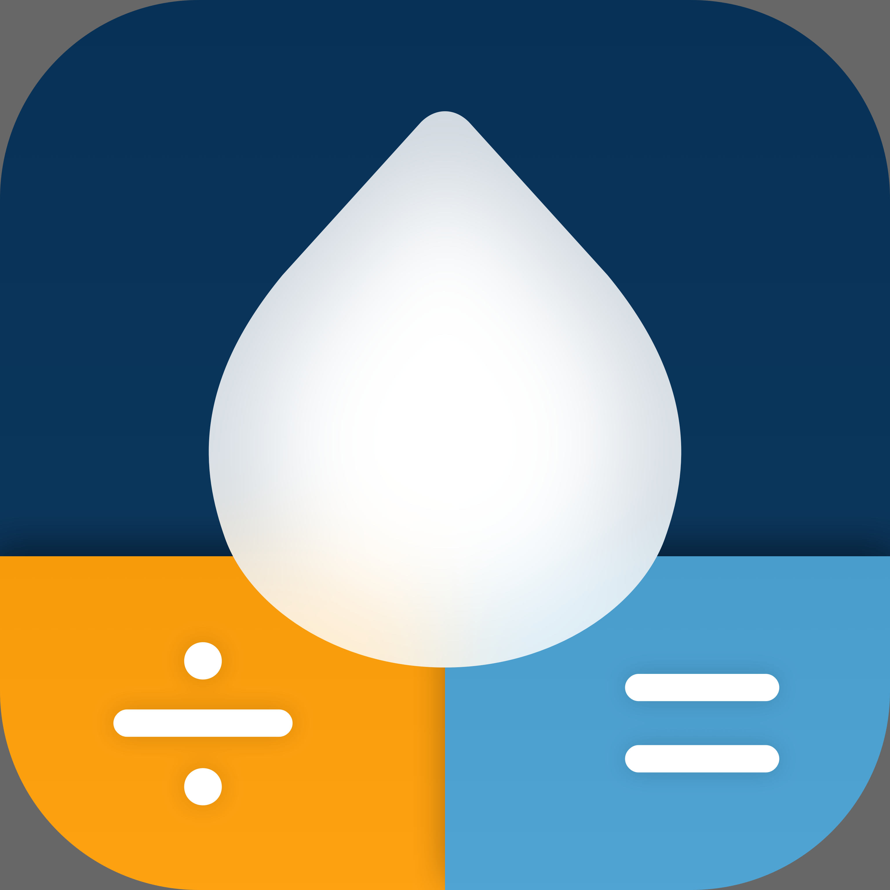
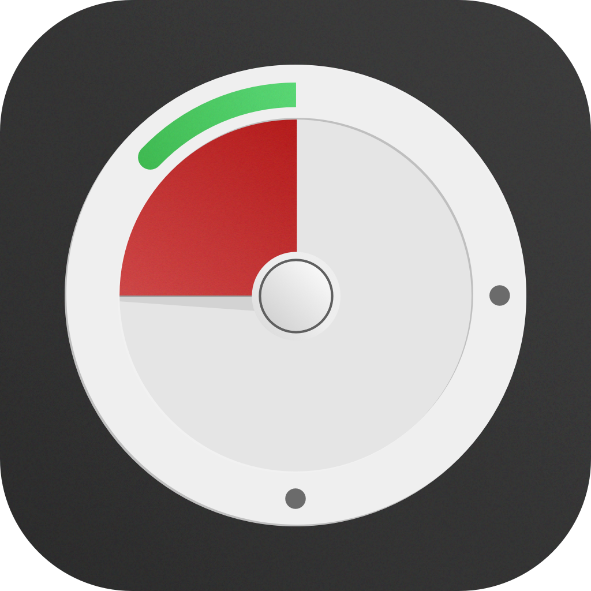
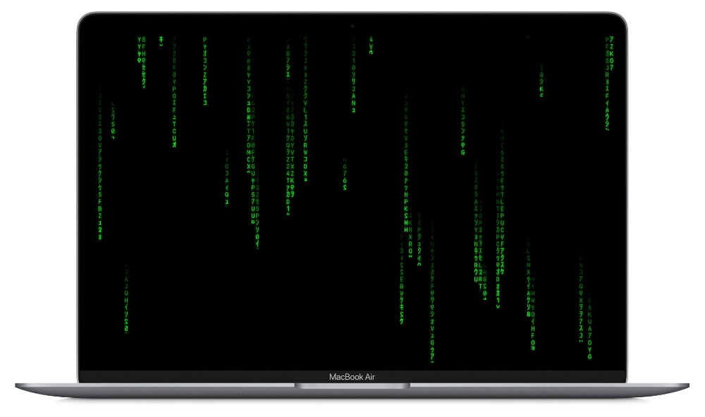

&nbsp; &nbsp; &nbsp; &nbsp;

&nbsp; &nbsp; &nbsp; &nbsp;

# Collection-of-Toy-Projects

## Overview
**토이 프로젝트** 모음   
- 앱을 출시하면서 필요한 부품들을 작성했던 개인 프로젝트입니다.
- 그 외로 추후에 필요할 것 같은 프로젝트
- 개인적으로 만들어 보고싶었던 프로젝트
- 정리차원에서 만든 프로젝트들의 모음입니다. 

## Contents
- [AutoLayout](#autoLayout)
- [UI-Control](#ui-control)
    - [DialControl](#dialControl)
    - [Keyboard](#keyboard)
    - [Ruler](#ruler)
    - [Segmented Control](#segmented-control)
    - [Stepper](#stepper)
    - [Switch](#switch)
    
- [Wallpaper](#wallpaper)
- [License](#license)

## AutoLayout
*Auto Layout을 프로그래머틱한 방식과 interface builder(xib, storyboard) 방식으로 보여주는 프로젝트*
- [AutoLayout **Adaptivity**](https://github.com/sonkoni/Collection-of-Toy-Projects/tree/main/Contents/AutoLayout_Adaptivity) - Device Size Classes 및 Orientation 에 따른 AutoLayout Adaptivity **테스트**

- [AutoLayout **Animation**](https://github.com/sonkoni/Collection-of-Toy-Projects/tree/main/Contents/AutoLayout_Animation) - 오토레이아웃과 UIView 애니메이션 조합 **테스트**
 
**[back to top](#contents)**

## UI-Control
### DialControl
- [DialControl Samples](https://github.com/sonkoni/Collection-of-Toy-Projects/tree/main/Contents/DialControl_Samples) - 휠을 돌려서 입력값을 설정할 수 있는 다이얼 컨트롤 테스트 샘플
### Keyboard
- [MGUNumKeyboard](https://github.com/sonkoni/Collection-of-Toy-Projects/tree/main/Contents/MGUNumKeyboard) - 커스텀 숫자 키보드
### Ruler
- [MGURulerView](https://github.com/sonkoni/Collection-of-Toy-Projects/tree/main/Contents/MGURulerView) - 스크롤 제스처로 몸무게를 설정할 수 있는 RulerView 
### Segmented Control
- [MGUNeoSegControl](https://github.com/sonkoni/Collection-of-Toy-Projects/tree/main/Contents/MGUNeoSegControl) - UISegmentedControl를 대체할 수 있는 커스텀 SegmentedControl. Written in Objective-C.

### Stepper
- [MGUStepper, MGAStepper](https://github.com/sonkoni/Collection-of-Toy-Projects/tree/main/Contents/Stepper) - UIStepper 및 NSStepper를 대체할 수 있는 커스텀 Stepper
    
### Switch
- [MGUSevenSwitch, MGASevenSwitch](https://github.com/sonkoni/Collection-of-Toy-Projects/tree/main/Contents/SevenSwitch) - UISwitch 및 NSSwitch를 대체할 수 있는 커스텀 스위치
- [MGUOnOffButton](https://github.com/sonkoni/Collection-of-Toy-Projects/tree/main/Contents/MGUOnOffButton) - Skeuomorphism(스큐어모피즘) 스타일 온오프 버튼.
- [MGUFlatSwitch](https://github.com/sonkoni/Collection-of-Toy-Projects/tree/main/Contents/MGUFlatSwitch) - 완료 및 체크를 상징하는 커스텀 스위치

**[back to top](#contents)**

## Wallpaper
*앱의 배경을 꾸며줄 수 있는 Wallpaper*
- [MGURegularPolygon](https://github.com/sonkoni/Collection-of-Toy-Projects/tree/main/Contents/MGURegularPolygon) - 앱의 배경을 꾸며줄 수 있는 애니메이팅 가능한 6각형 조각으로 빈틈없이 채우는(hexagonal tiling) Wallpaper View

**[back to top](#contents)**

## License

This project is released under the MIT License. See [LICENSE](https://github.com/sonkoni/Collection-of-Toy-Projects/blob/main/LICENSE) for more information.

**[back to top](#contents)**
